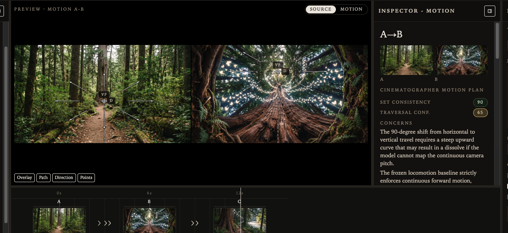
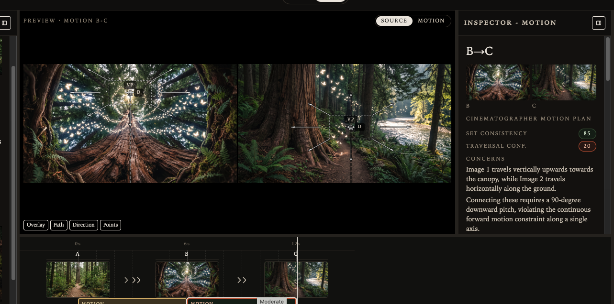
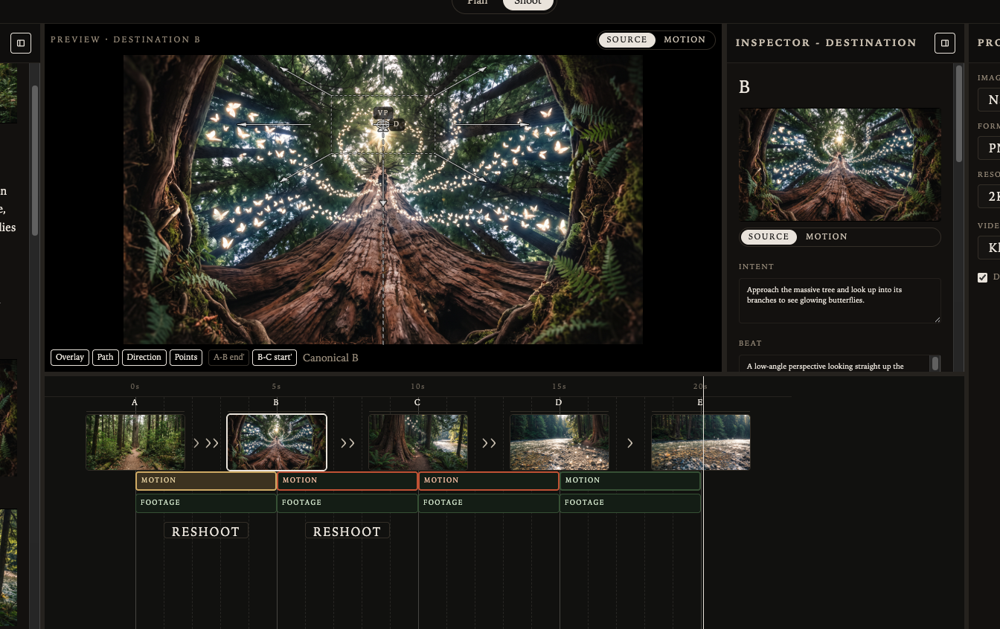

# TunnelVision backlog

This is the **canonical GitHub-tracked product and engineering
backlog**. It is the source of intent for future implementation
plans. A later Cursor session should be able to turn any entry into
a detailed plan without prior chat history.

Research brainstorms and unvalidated Camotion questions stay in
[RESEARCH_BACKLOG.md](RESEARCH_BACKLOG.md). Current-code facts stay
in [PRODUCT.md](PRODUCT.md), [AGENTS.md](AGENTS.md),
[ARCHITECTURE.md](ARCHITECTURE.md), and
[IMPLEMENTATION.md](IMPLEMENTATION.md). Journey-prompting
philosophy and experimental findings stay in
[PROMPT_COACH.md](PROMPT_COACH.md). Do not implement a Prompt Coach
agent from that file.

Do not implement from this file until a session is explicitly asked
to take an item. Do not re-litigate completed product work here.

## How to use this file

Each item records **goal, why, intended behavior, constraints,
likely code areas, and open questions**. Status is a planning label,
not a CI check.

Organize roughly as:

1.  Hackathon / discovery (do not implement now)
2.  Hackathon / Agent priorities
3.  Filmmaking intelligence
4.  Camotion / visual quality
5.  Output / persistence
6.  Provider / infrastructure
7.  Future UX

### Status

| Status | Meaning |
| --- | --- |
| **BACKLOG** | Accepted work; not started. |
| **HACKATHON / DISCOVERY** | Event-day or immediately pre-event research. Not a current implementation task. Do not start from a normal product session. |
| **VALIDATE** | Characterize current behavior; change only if it fails the spec. |
| **EXPERIMENT** | Evidence-gathering; do not productize from a single run. |
| **READY** | Scoped enough to implement. |
| **IN PROGRESS** | Actively being built. |
| **DONE** | Shipped; move narrative to product docs, do not keep as unfinished. |
| **DEFERRED** | Still valid, explicitly not now. |

Items below are **BACKLOG** unless a later edit changes the status.

---

## Pre-hackathon focus

The core filmmaking Agent is proven. Freeze that pipeline. Treat
existing generation, canonical-frame, traversal, Camotion, export,
and JourneyAgent as a **library** the hackathon surface will call.

Next workstation work, in order:

1.  Timeline / Takes UX polish
2.  Project persistence / shared Project format — **in product**
    (directory format under the configured Projects Folder)
3.  Basic robustness and regression testing
4.  Fresh-machine / config / secrets readiness
5.  Freeze the core filmmaking pipeline before the event

Do **not** implement camera-grammar baselines, “fix” the Reverse
Lead astronaut override, Discover, or agentic Model Router policy
before the event. Those are **HACKATHON / DISCOVERY**.

Hackathon-day work is a **new** one-prompt cinematic surface over
that shared Project, plus Runway Model Router agentic control.
Camera-grammar classification is a second discovery thread and
must not displace the Router research. See
[HACKATHON.md](HACKATHON.md).

Do **not** spend pre-hackathon time inventing a Footage Evaluator,
Agent take-selection, Draft/Final project modes, or a second
movie representation.

---

## Hackathon / discovery (do not implement now)

Planning only. Event-day write-up: [HACKATHON.md](HACKATHON.md).
These items are **HACKATHON / DISCOVERY**, not current product
work.

### Dedicated hackathon UI surface

**Status:** HACKATHON / DISCOVERY — do not implement from a normal
product session.

**Goal.** A purpose-built, nearly full-screen autonomous experience:
one prompt → CREATE JOURNEY → hands off → watch the film crew →
play the movie in the same surface.

**Why it matters.** The claim is fully unattended agentic journey
creation, not “AI video generation” and not a restyled Plan | Shoot.

**Intended behavior / design.**

-   New route / Vite entry. Not a visual mode inside the editor.
-   Initial state: prompt + CREATE JOURNEY. Optional Open Project.
-   After CREATE JOURNEY: live cards for Director, destinations,
    CM (scores + grammar when that discovery exists), model
    routing, shooting, retry, and progress (`A ━━━✓━━━ B …`).
-   Completion: same surface becomes the player. Download / Open
    in TunnelVision.
-   Chat / tool commands are architecturally important and
    **later** than the unattended demo.

Standard TV stays the detailed creative environment. Both surfaces
read/write the same Project. Details:
[HACKATHON.md](HACKATHON.md).

**Constraints / invariants.**

-   Do not replace or gut Plan | Shoot.
-   Do not invent a hackathon-only project schema.
-   Do not require user clicks after CREATE JOURNEY for the hero
    demo.

---

### Camera grammar classification

**Status:** HACKATHON / DISCOVERY — pre-hackathon implementation
**target**, not current product. Do **not** retune the single FPOV
locomotion baseline as a one-off prompt tweak. Mixed-grammar
journeys are **post-hackathon**.

**Goal.** Support **four whole-journey camera grammars** — POV,
FOLLOW, LEAD, MOUNTED — so a continuous shot of arbitrary length
can use one selected grammar instead of forcing every shot through
forward POV.

**Why it matters.** The Director can already plan non-POV camera
intent. The current Cinematographer baseline
(`TUNNELVISION_LOCOMOTION_BASELINE_TEMPLATE`) still assumes
continuous forward travel and avoidance of FPS-style foreground
objects, and can override valid Director intent.

**Hackathon rule.** One journey = one camera grammar. Do not
switch grammar mid-journey before hack day.

**Terminology (use these names):**

-   **POV** — camera is the traveler (formerly FPOV / first-person
    POV)
-   **FOLLOW** — invisible objective camera follows the subject.
    **Not** true first-person. Formerly FP Follow / FP_FOLLOW.
-   **LEAD** — invisible objective camera retreats ahead of the
    subject while facing them. Formerly Reverse Lead /
    REVERSE_LEAD.
-   **MOUNTED** — camera physically attached to the subject or
    vehicle; persistent foreground geometry is expected

Retire **FP Follow** and **Reverse Lead** as names.

Later (not hackathon taxonomy): SIDE_TRACK, ORBIT, ASCEND/DESCEND,
OBJECT/PROJECTILE, SUBJECT HANDOFF, FREE.

**Pre-hackathon failure case (preserve).** LEAD astronaut
experiment: Director planned a backward-moving camera that kept
facing the astronaut. CM rewrote the shots to pass the astronaut
and continue forward because the baseline required forward travel.
Keep this as the exhibit. Do not “fix” it by making the single
FPOV baseline more permissive.

**Intended pre-hackathon work (target, not necessarily done):**

-   grammar choice / classification using POV, FOLLOW, LEAD,
    MOUNTED
-   Director / Prompt Coach / CM prompts aligned to the selected
    grammar
-   grammar-specific conditioning across the full journey
-   persist selected journey grammar on the Project when
    implemented
-   keep grammar stable for the entire journey

Canonicals stay pristine story-space destinations. Because grammar
does not switch, they do not yet need incoming/outgoing camera
variants.

**Duration / pace.** Nice to have if easy, not core. Prefer pace
or shot-length intent over precise duration. If CM returns a
pace/duration hint, map it to the nearest duration the selected
video model supports. Remap if the model changes. See
[HACKATHON.md — Camera grammar](HACKATHON.md#camera-grammar--hackathon-decision).

**Constraints / invariants.**

-   Do not make one universal locomotion prompt more permissive.
-   Do not classify per traversal for hackathon scope.
-   Current product law in [AGENTS.md](AGENTS.md) stays unembodied
    POV until this discovery lands.
-   Prompt Coach may structure legs/beats but must keep one
    grammar for the journey. See [PROMPT_COACH.md](PROMPT_COACH.md).

**Open questions.** See [HACKATHON.md](HACKATHON.md) and
[RESEARCH_BACKLOG.md](RESEARCH_BACKLOG.md#camera-grammar).
Human-facing camera-intent language vs internal grammar:
[PROMPT_COACH.md](PROMPT_COACH.md). Do not leak current locomotion
workarounds into the filmmaker's Journey prompt.

**Explicitly post-hackathon:** mixed-grammar journeys; grammar
switching within a journey; canonical reinterpretation for
different incoming/outgoing shot grammars; advanced coverage
planning across multiple grammars.

---

### Agentic Runway Model Router control

**Status:** HACKATHON / DISCOVERY — major Runway research. Adapter
plumbing is the related [Runway hackathon integration](#runway-hackathon-integration)
item. Do not start routing policy from a normal product session.

**Goal.** Can an autonomous filmmaking agent use camera intent,
geometry, Traversal Confidence, and previous generation results to
decide **how** a shot should be generated on Runway — not a single
fixed model for every traversal?

**Why it matters.** Camera grammar is one thread. It must not
displace this. The judge-facing product is a persistent Project +
autonomous Director/CM + grammar-aware shooting (if found) +
agent-controlled Router + evaluation/retry + one-prompt UX.
Do not collapse Prompt Coach, Camera Grammar, and Model Router into
one giant prompt; see [PROMPT_COACH.md](PROMPT_COACH.md).

**Intended behavior / design.** Discovery-driven. Do not hard-code
Router capabilities until event-day docs and org access exist.
Public Router API facts stay in [HACKATHON.md](HACKATHON.md) §14.

Potential signals: grammar, Traversal Confidence, Set Consistency,
subject persistence, motion amount, environmental transformation,
prior success/failure, cost/latency if relevant.

Surface the chosen route / model and a short reason on the
hackathon cards. Persist those decisions on the shared Project.

**Constraints / invariants.**

-   Router augments TV; it does not replace Director, CM, Camotion,
    or JourneyAgent.
-   Do not invent Draft/Final project modes.

---

## 1. Hackathon / Agent priorities

### Agent mode

**Status:** Happy path, sequential canonical construction, Traversal
Confidence repair, overlapping NEW TAKE, and assembly are in
product. LOOP, provider-aware concurrent filming, and durable
persistence remain BACKLOG. Footage Evaluator / Agent take
selection are **retired explorations**, not planned Agent stages.

**Goal.** Implement fully autonomous journey execution. AGENT
executes the journey. It does not merely press the existing
Directed UI buttons in sequence.

**Shipped.** CREATE JOURNEY in AGENT mode runs
`web/src/project/journey-agent.ts` on the same `Project` as
Directed. Proven pipeline:

Director
→ sequential canonical construction
→ CM evaluation of each inbound pair
→ bounded canonical repair when Traversal Confidence is below 30
→ Camotion
→ asynchronous NEW TAKE as established segments become available
→ selected Takes
→ assembly / export

The Agent does **not** judge artistic footage quality or replace
Takes. The filmmaker remains the authority over footage quality
and final Take selection. Failures stop the Agent (`FAILED`), keep
partial work, and record a reason.

**Why it matters.** Directed mode is a filmmaker-in-the-loop
workspace. AGENT is the unattended first cut: prompt in, assembled
journey out. Quality iteration is NEW TAKE, not a second Agent
stage or a Draft/Final project mode.

**Intended behavior / design.** Target loop:

1.  Journey prompt.
2.  Establish or generate canonical A.
3.  Director plans the journey (WHERE it goes).
4.  Generate the next canonical (currently DERIVE from the
    preceding actual still plus Director plan).
5.  Cinematographer evaluates the actual adjacent pair (HOW it can
    be shot). Set Consistency is a diagnostic; Traversal Confidence
    is the filmability gate.
6.  If Traversal Confidence is below 30, repair only the new END
    (max 2). Low Set Consistency alone does not trigger repair.
    Surreal thresholds (door, arch, tunnel, cave, airlock, portal,
    darkness) and actionable obstacles (a closed door that can
    open in the shot) can keep Traversal Confidence high.
7.  Deterministic bridge writes CameraMotionPlan; Camotion
    conditions A′/B′.
8.  Launch NEW TAKE as soon as the inbound pair is established.
    Canonical work continues sequentially; footage may overlap.
9.  Advance through remaining canonicals.
10. Await in-flight Takes. Assemble selected Takes in storyboard
    order. See [Final journey export](#final-journey-export).

Preserve the existing architecture. Do not invent a second
cinematic stack. There is no separate Final movie state. The
currently selected Take on each segment **is** the cut.

| Role | Decision |
| --- | --- |
| Director | WHERE the movie goes. Structured intent, not CameraMotionPlan JSON. |
| Cinematographer | HOW the **actual** adjacent canonical pair can be shot. Semantic travel + scores + pace. |
| Camotion | Deterministic execution of CameraMotionPlan. No LLM. |
| Video provider | Traversal footage. Adapter-mapped start/end frames. |
| Canonicals | Authoritative journey state. Never silently replaced. |
| Filmmaker | Footage quality and which Take is the cut. |

The first Agent pass has **no additional user-facing options**
beyond agency. Agency (Directed vs Agent) already exists as an
orthogonal control-mode toggle. **LOOP** is accepted later work:
an explicit project/Agent option, not inferred from the Journey
Prompt, and not part of the current happy path. See
[Agent LOOP option](#agent-loop-option).

Directed Options (generate all, auto-block,
auto-shoot) are **not** AGENT. They automate filmmaker clicks
inside Directed. AGENT owns the unattended construct / CM / repair /
NEW TAKE / export loop. The filmmaker still selects Takes. AGENT
does not grow a settings panel, repair-policy UI, or DERIVE/DISCOVER
control until those strategies exist as real behavior.

**Constraints / invariants.**

-   A is required before cinematic workflow begins (generate A if
    needed; do not start CM/video on FPO-only pairs).
-   Director resolves unspecified directing decisions; it does not
    overwrite specified filmmaking decisions or generate images.
-   Story edits do not invoke Director. AGENT may call Director as
    part of its own loop; that is not hidden Directed autonomy.
-   CM runs on actual adjacent canonical images only.
-   Motion Plans belong to segments. Changing either canonical
    invalidates and recomputes only affected adjacent segments
    (if B changes: A→B and B→C when C exists). Do not recompute
    unrelated legs.
-   Shared canonical B may have different inbound B′ and outbound
    B′.
-   Camotion stays deterministic. Centered VP is fallback only.
-   Video uses both start and end conditioned frames when the
    provider supports first/last frame.
-   Segment-specific shooting direction precedes the locomotion
    baseline. No second LLM rewrite of that compose.
-   No hidden autonomous behavior in Directed mode.
-   Provider IDs stay behind adapters.

**Likely implementation areas.**

-   `web/src/project/ProjectProvider.tsx` — agency, CREATE JOURNEY,
    sequential construct/block/shoot. Replace “flip auto flags” with
    an Agent runner that owns the loop.
-   New Agent orchestrator (product path, not a fourth filmmaking
    role): decide next action from project state + CM + later
    critique.
-   Existing Director (`web/src/project/director.ts`,
    `media/src` reasoning), destination construct
    (`web/src/project/destination.ts`, `web/destination-construct.ts`),
    CM (`media/src/cinematographer/assess-journey.ts`), Motion Plan
    bridge (`media/src/cinematographer/camera-motion-plan.ts`),
    shoot (`web/shoot-journey.ts`).
-   Conversation may show Agent turns as progress, but conversation
    is not project persistence.
-   Do not rebuild Plan | Shoot core for hackathon. A stripped
    Agent-facing timeline may sit on top. See
    [Runway hackathon integration](#runway-hackathon-integration).

**Open questions.**

-   When CM says hold / no-go, does AGENT always enter the repair
    loop, or is there a shoot-anyway policy after retries? Default:
    retry 1–2 times, then shoot or flag. See CM repair item.
-   Does AGENT re-plan remaining beats after a reshoot changes the
    actual world, or only re-run CM on the affected pair? Prefer
    pair-local repair first; Director replan only when the
    destination concept is no longer the intended movie.
-   How much of Directed conversation UX does AGENT reuse vs a
    minimal “building journey…” surface?

---

### Agent LOOP option

**Status:** BACKLOG — do not implement during the current
JourneyAgent happy-path work. Happy-path completion stays the
immediate priority.

**Goal.** Let AGENT close a generated journey on the **exact
opening canonical A** so the assembled movie can loop
continuously in space and story, not merely by repeating the
finished file in a player.

**Why it matters.** A continuous first-person journey that ends
where it began is a distinct product shape: A → B → C → D → A,
with the final A the same asset as the opening A. Inferring that
from the Journey Prompt is unreliable. Recreating A as a new
still is the wrong close: the last traversal would arrive at an
approximation, so playback loop would hitch. Integration Test 01
Wardrobe Loop is research evidence of a five-shot return, not
this option and not exact-asset reuse.

**Intended behavior / design.**

LOOP is an **explicit project/Agent option**. Off by default.
The filmmaker does not have to write “return to the beginning”
into the Journey Prompt. Do not rewrite `project.story` merely
to express this implementation detail.

When LOOP is enabled:

1.  Canonical A remains the authoritative opening frame.
2.  JourneyAgent establishes A if needed, then DIRECTs as today.
3.  Give Director enough extra semantic instruction (Agent-side,
    not a Journey Prompt rewrite) that the planned preceding
    destination(s) make a natural return to the opening viewpoint
    possible. Director must know the journey ultimately returns
    to its starting viewpoint.
4.  After Director resolves the journey, Agent **appends A
    itself** as the final canonical destination. Director’s
    destination count does not include that closing slot; Agent
    adds it.
5.  Do **not** generate an approximation or recreation of A for
    the close. Reuse the exact opening A media. The closing slot
    is a distinct storyboard destination in travel order whose
    canonical still is that same media ID.
6.  The final segment is therefore **N→A**. Plan and shoot it
    through the normal CM → Camotion → Take pipeline, same as
    any other adjacent pair.
7.  The final A participates as the actual endpoint canonical, so
    the last traversal arrives at the exact frame the movie
    begins on.
8.  N→A can have multiple Takes like any other segment. Newest
    Take selection and Export Movie concat are unchanged.

Target result:

> A → B → C → D → A

Opening A and closing A are the same canonical asset. Outbound
A′ on A→B and inbound A′ on N→A may differ; that is the existing
shared-canonical inbound/outbound rule, applied to A.

LOOP is **not** player-loop of the finished MP4. It is spatial /
narrative return to exact canonical A. Concatenation then
happens to be continuously loopable because the last arrival is
the first departure.

**Constraints / invariants.**

-   Do not infer LOOP from Journey Prompt text.
-   Do not invent a second A still.
-   Do not require the filmmaker to add a return beat by hand.
-   Preserve the filmmaker’s Journey Prompt.
-   Opening A stays undeletable. Closing A is reuse of that
    asset, not a generated replacement.
-   Do not treat this as Directed click-automation. It is an
    Agent/project option that JourneyAgent honors.
-   Do not change locomotion, CM, Camotion, or canonical
    Construct prompts to special-case the close. N→A is a normal
    adjacent pair once the last still is exact A.
-   First-pass JourneyAgent COMPLETE / FAILED rules stay as they
    are; LOOP is additional topology, not a reason to skip
    assembly.

**Likely implementation areas.**

-   Project flag (explicit option, default off)
-   Agent Project-panel control (not Directed Options)
-   Director request: extra return-to-A instruction when LOOP is
    on; do not mutate `project.story`
-   `web/src/project/journey-agent.ts` — after DIRECT, append a
    destination whose still is opening A’s media, then continue
    construct of *other* unresolved beats, Motion Plan, NEW TAKE
    (including N→A), assemble
-   Storyboard / destination identity: last slot shares A’s
    media ID; Takes already stamp start/end media IDs
-   Look-ahead: the last *generated* destination N may need
    opening A as far-field so N is shootable toward A. Today the
    last beat has no look-ahead, and look-ahead is following
    *text*, not the actual still. See
    [Canonical look-ahead / continuity tuning](#canonical-look-ahead--continuity-tuning).

**Open questions.**

-   Storyboard lettering: visible A, B, C, D, A vs a distinct
    last letter that still uses A’s media?
-   AUTO destination count: does N mean destinations before the
    close (Agent appends A) or including it?
-   Does construct of N image-condition toward actual A, or only
    receive Director text that a return is coming?
-   If the filmmaker already supplied a last still, does LOOP
    refuse, replace that slot with exact A, or append after it?
-   Directed LOOP later, or Agent-only forever?

Related, do not duplicate:

-   [Agent mode](#agent-mode) — first happy path; no LOOP yet
-   [Takes](PRODUCT.md) / Product Slice 11 — N→A Takes
-   [Final journey export](#final-journey-export) — concat of
    selected Takes, including N→A
-   Integration Test 01 Wardrobe Loop — research return journey,
    not exact-A reuse

---

### Parallel segment filming

**Status:** BACKLOG for provider-aware queueing. JourneyAgent now
launches NEW TAKE as soon as each inbound pair is established and
awaits in-flight Takes before assembly. Remaining work is adapter /
Runway THROTTLED handling, not Agent serial waiting.

**Goal.** Once every required canonical and its Motion Plan /
Camotion A′/B′ are ready, submit independent segment footage
generations concurrently. Let the **provider / adapter** decide
how those jobs run. Assemble selected Takes in canonical
storyboard order.

**Why it matters.** Video generation dominates wall time. Once a
segment’s stills and Motion Plan exist, its NEW TAKE does not
depend on later canonical work or on other segments’ footage.
Serial waiting on clip generation is leftover sequencing, not a
filmmaking constraint. JourneyAgent now launches each NEW TAKE as
soon as that inbound pair is established so A→B can film while
B→C is still being constructed. Remaining latency is provider
queueing: concurrent submission should let the adapter / Runway
decide in-flight work. Movie order must stay deterministic
regardless of which provider call finishes first.

Do **not** assume TunnelVision must own a fixed bounded-concurrency
queue (2, 3, or similar). That was the earlier sketch. Runway
already manages organization-level generation concurrency.

**Intended behavior / design.**

Keep construct sequential. DERIVE still needs the preceding
actual still. Do not parallelize destination generation.

Potential later filming flow:

1.  Construct all unresolved canonicals (still serial).
2.  Complete / await Motion Plan + Camotion for every required
    adjacent segment.
3.  Submit all independent ready-segment footage generations
    concurrently.
4.  The provider manages / queues work according to its
    capabilities.
5.  Await all required Takes.
6.  Assemble selected Takes in canonical order
    (A→B, B→C, C→D, …), never in completion order.

**Provider-aware scheduling.** JourneyAgent does not pick a
universal in-flight number. Split the decision:

| Layer | Responsibility |
| --- | --- |
| JourneyAgent | These N independent shots are ready. |
| Provider / adapter | Submit concurrently, queue remotely, or bound locally according to that provider’s API. |

**Runway-specific finding.** Runway’s API already provides
organization-level generation concurrency management:

-   Video generations share an organization concurrency pool.
-   Jobs beyond the current allowance may still be submitted.
-   Excess jobs enter **THROTTLED** and are queued by Runway.
    TunnelVision does not need to serialize them itself.
-   THROTTLED is a normal waiting state, similar to PENDING, not
    a generation failure. HACKATHON.md already records
    `THROTTLED` as queued, not an error.
-   The hackathon Agent should generally submit **all** ready
    segment generations and let Runway manage execution
    concurrency.
-   Runway task completion order must never determine movie
    order. Storyboard / canonical order stays authoritative.
-   Respect provider / API retry guidance. Distinguish retryable
    transport / API failures from normal queued / throttled
    tasks.

For other providers, the adapter may impose bounded concurrency
or serialization if that API / rate limit requires it. That is
adapter policy, not a JourneyAgent constant.

Current serial SHOOTING in
`web/src/project/journey-agent.ts` remains the correct v1
behavior. This item does not change COMPLETE: every required
adjacent segment still needs a valid selected Take, the movie
must be exportable, and assembly must succeed.

**Constraints / invariants.**

-   Each Take stays associated with its segment / canonical pair
    (`startCanonicalMediaId` / `endCanonicalMediaId`). Segment
    letters are not the compatibility key.
-   A failed segment stays identifiable (which journey, which
    Take attempt, why). Do not collapse concurrent errors into a
    generic “shooting failed.”
-   Asynchronous completion must not reorder the assembled movie.
    Export Movie concat stays storyboard / travel order.
-   Preserve partial successful Takes if another segment fails.
    First-pass FAILED already keeps work already on the Project;
    concurrent filming must not discard finished Takes on a
    sibling leg.
-   Agent activity UI may show multiple shots generating or
    waiting (PENDING / THROTTLED) at once. That does not imply
    movie order.
-   Do not invent a second shoot pipeline. Reuse `createTake` /
    `shootJourney` / NEW TAKE.
-   Directed click-automation (auto-shoot) is out of scope unless
    a later pass shares the same provider-aware runner.
-   Repair / evaluation stays pair-local and prior. Do not
    concurrent-film in order to skip repair.

**Likely implementation areas.**

-   `web/src/project/journey-agent.ts` SHOOTING phase — today a
    serial `await createTake` per journey
-   `ProjectProvider` `shootJourneyOn` / in-flight maps —
    concurrent Project updates and Take appends on different
    journeys
-   Video adapter (`media/src/runway/` on hackathon day; other
    MediaProvider adapters as needed) — submit vs local bound vs
    treat THROTTLED / PENDING as wait, not fail
-   Activity events: several “creating A→B TAKE 1” /
    waiting-throttled states at once without implying concat
    order
-   Tests: completion order ≠ concat order; one leg fails, others
    keep Takes; THROTTLED is not FAILED; COMPLETE concatenates
    in travel order

`inFlightMotionPlans` already coalesces concurrent Motion Plan
callers for the **same** pair. That is not concurrent filming and
does not authorize this item.

**Open questions.**

-   After a repair invalidates B, inbound A→B and outbound B→C
    must not stay in flight on stale A′/B′.
-   LOOP N→A is just another independent ready segment once
    Motion Plan exists.
-   Should Motion Plan / Camotion also run concurrently after all
    canonicals exist, or only NEW TAKE?
-   How the adapter reports THROTTLED vs retryable HTTP failure
    into JourneyAgent activity without treating queue wait as
    FAILED.

Related, do not duplicate:

-   [Agent mode](#agent-mode) — serial first pass is shipped
-   [Agent CM repair / reshoot loop](#agent-cm-repair--reshoot-loop)
    — do this before concurrent filming
-   [Agent cinematic-quality critique](#agent-cinematic-quality-critique)
-   [Final journey export](#final-journey-export) — concat order
    is canonical, not finish order
-   [Runway hackathon integration](#runway-hackathon-integration)
    — latency win for demos; not event-day implementation
-   HACKATHON.md task lifecycle — `THROTTLED` is queued, not an
    error

---

### Agent CM repair / reshoot loop

**Status:** EXPERIMENTAL PASS — implemented in JourneyAgent. Thresholds
are intentionally aggressive so the loop can be proven; they are not
permanent filmmaking policy.

**Goal.** Let AGENT recover when the Cinematographer finds an
actual adjacent pair difficult or impossible to shoot continuously,
including by regenerating a weak canonical while passing the
opposite endpoint as a visual image reference.

**Why it matters.** CM already inspects actual sets. Without a
repair loop, AGENT stops or ships unshootable legs. Video prompts
cannot invent missing physical geography. Repair must change only
the requested canonical(s), use the opposite still as a visual
reference when that is the smallest fix, and re-evaluate the
affected pair(s).

**Core principle.** Fix the set before shooting the scene. Do not
compensate for fundamentally poor canonical geometry with
increasingly elaborate video prompts.

This is pair-endpoint repair, not construct-time look-ahead.
Look-ahead uses a *following* actual (C) as a secondary future
reference while generating B. Pair repair uses the *opposite*
endpoint of the pair CM just judged (B while regenerating A, or A
while regenerating B). See
[Canonical look-ahead / continuity tuning](#canonical-look-ahead--continuity-tuning).

**Intended behavior / design.**

CM recommendation vocabulary (new; not a Camotion suitability
enum). Prefer the smallest repair:

| Recommendation | Meaning |
| --- | --- |
| **SHOOT** | Pair is acceptable; proceed to Motion Plan / footage. |
| **RESHOOT_START** | Start canonical is the problem; regenerate only that still. Use END as visual reference. |
| **RESHOOT_END** | End canonical is the problem; regenerate only that still. Use START as visual reference. |
| **RESHOOT_BOTH** | Neither frame can reasonably anchor a continuous traversal; regenerate the pair. |

CM also emits, on the same assessment turn when possible:

-   **concise diagnosis** — why the pair is weak (missing route,
    impossible orientation, invented geography, and so on)
-   **concise repair instruction** — what the regenerated still
    must establish so the segment becomes physically shootable
-   **whether the opposite endpoint should be used as a visual
    reference** (yes for START/END; coordinated pair for BOTH)

Distinguish **canonical repair** from **prompt repair**:

| Problem | Action |
| --- | --- |
| Route is visible in the stills; video needs clearer choreography | Improve `segmentPromptAddition` / shoot. Do not replace canonicals. |
| Route is not actually represented by the canonical images | Canonical RESHOOT. Do not solve missing geography with text. |

Shootability scores (`setConsistency`, `traversalConfidence`)
remain advisory evidence. The recommendation is the Agent action.
Do not invent a second CM LLM call if the existing assessment turn
can carry the recommendation; prefer extending that JSON.

**RESHOOT_START** on A→B:

-   Preserve A’s semantic intent and its role in the journey.
-   Keep actual B authoritative and unchanged.
-   Pass actual B as an **image reference** while regenerating A.
-   The new A must still be that opening place, but its
    composition / viewpoint must provide a plausible continuous
    route toward B.
-   Do not make A resemble B. Make A and B belong to a shootable
    continuous space.

Example: A is a broad street; B is a narrow alley that is
completely invisible in A. CM reports low traversal confidence
because the video model would have to invent the alley entrance.
Desired recommendation: `RESHOOT_START`. Regenerate A so the alley
entrance or a spatially plausible approach is visible or implied,
then re-run CM on the new A→B pair.

**RESHOOT_END** on A→B:

-   Preserve B’s semantic intent.
-   Keep actual A unchanged.
-   Pass actual A as an **image reference** while regenerating B.
-   The new B must remain the intended arrival, with geography
    that is plausibly reachable from A.

**RESHOOT_BOTH:**

-   Use only when CM determines that neither frame can reasonably
    anchor a continuous traversal.
-   Preserve both Director intents.
-   Generate them as a coordinated pair.
-   Maintain larger-journey continuity with neighboring
    canonicals.
-   Never choose BOTH when changing only one endpoint can solve
    the problem.

Agent loop:

1.  Resolve / generate the actual adjacent canonical pair.
2.  CM evaluates those actual images (existing assessment plus
    the recommendation fields above).
3.  If SHOOT, continue (Motion Plan → Camotion → video).
4.  If canonical geometry is the problem, choose START / END /
    BOTH (smallest repair) and regenerate the requested
    canonical(s), passing the opposite still as an image
    reference where appropriate. See
    [Revise vs reshoot](#revise-vs-reshoot): missing alley
    entrance, impossible orientation, or severe spatial
    discontinuity is generally RESHOOT, not REVISE.
5.  Re-run CM on the affected pair.
6.  Retry at most **1–2** times (existing Agent repair limit).
7.  If acceptable → Camotion → video generation.
8.  If still weak: shoot anyway **or** flag the segment for
    review, according to the existing fallback policy. Do not
    loop forever.

**Constraints / invariants.**

-   Existing canonical images are authoritative until AGENT
    explicitly enters a repair operation.
-   A repair replaces only the endpoint CM identified as
    problematic. Never silently replace both when one is enough.
-   Preserve Director intent for the regenerated canonical.
    Preserve unrelated canonicals.
-   After repair, invalidate / recompute only affected adjacent
    SegmentMotionPlans and footage. If B is regenerated,
    reevaluate A→B and B→C when C exists. Do not recompute
    unrelated segments.
-   Opening A cannot be deleted; it can be regenerated if CM asks
    RESHOOT_START on A→B and A is generated (uploaded A stays
    Replace, not silent overwrite).
-   No Camotion suitability enum. CM does not emit CameraMotionPlan
    JSON.
-   Repair guidance and the opposite-still reference are for
    construction / reshoot of the **canonical**, not for
    video-model prompt rewriting by a second LLM.

**Likely implementation areas.**

-   `media/src/cinematographer/assess-journey.ts` parser/schema
-   `media/src/cinematographer/assessment-prompts.ts`
-   `web/src/project/types.ts` `CinematographerAssessment`
-   `web/src/project/journey-agent.ts` / `journey-agent-repair.ts`
-   `destinationRepairRequestFromProject` / Nano Banana extra
    `image_input` reference stills
-   Existing Motion Plan invalidation when canonical media identity
    changes (`motionPlanAutoKey`, `hasCurrentMotionPlan`)

**Experimental Pass 2 (current).** JourneyAgent constructs the journey
**one canonical at a time.** After each new END is generated, CM
evaluates that inbound pair. **Traversal Confidence < 30** triggers
repair of that new END only. Low Set Consistency alone does not.
Set Consistency remains a CM diagnostic. The established START is
never rewritten. CM supplies a concise
spatial instruction for regenerating END from the established START.
Max **2** attempts per END; after the budget, Agent accepts the
current still and continues if technically shootable. Only
Agent-generated canonicals with no dependent Takes may be
overwritten. Filmmaker-supplied or Take-dependent canonicals fail
through existing Agent FAILED/activity. Agent conversation cards
show RESHOOT vs RESHOOT COMPLETE with before/after scores.
Thresholds live in `JOURNEY_AGENT_REPAIR_THRESHOLDS`. Canonical
revisioning remain BACKLOG. Footage Evaluator and automatic footage
retakes are retired explorations, not planned Agent stages.

Sequence: generate B → CM A→B → repair B if needed → accept B →
generate C from the **final** B → CM B→C → repair C if needed →
advance. Camotion / NEW TAKE / assembly run only after the sequential
canonical pass. CM results are stamped to the exact start/end media
IDs; a result is discarded if either canonical changed while the
evaluation was in flight. Automatic Directed Motion Planning does
not run while JourneyAgent is busy.

**Open questions.**

-   Map today’s shootable / hold / no-go onto SHOOT vs repair, or
    replace that enum with the recommendation?
-   Flag-for-review surface in AGENT with no extra options: likely
    a conversation/timeline mark, not a settings pane.
-   Uploaded canonicals: skip silent reshoot; flag instead.
-   Does START repair of generated A use opening-frame generation
    with B attached as a reference image, or destination-construct
    edit of A with B as secondary input?
-   Provider support for a second reference image on opening A
    (Nano Banana accepts `image_input`; product A is still text-only
    today).

Related, do not duplicate:

-   [Parallel segment filming](#parallel-segment-filming) —
    latency work **after** this repair loop works. Serial filming
    stays correct until then.

---

### Agent cinematic-quality critique

**Status:** DEFERRED — canonical / journey-intent critique only.
Not a Footage Evaluator. Not Agent take selection.

**Goal.** Add Director/Agent-level evaluation of whether generated
**canonicals** make a good movie, separate from CM shootability.

**Why it matters.** A still can be beautiful and fully shootable
and still fail the movie: no escalation, no payoff, two beats that
look like the same place, or a finale that ignores the journey
prompt. CM cannot be the only critic of *destinations*. The
filmmaker remains the critic of *generated footage*.

**Intended behavior / design.**

Two questions stay distinct:

| Role | Question |
| --- | --- |
| Cinematographer | Can this canonical pair be filmed as one continuous shot? |
| Director / Agent critique | Do these canonicals serve the movie we want? |
| Filmmaker | Is the generated Take artistically good? Which Take is the cut? |

This item is the middle row only. Do **not** turn it into automatic
clip judging, alternate-Take generation, or Agent-chosen finals.

The experimental Shot Evaluator in
`media/experiments/forest-a-to-f/` is a retired research probe, not
this product path and not a planned Agent stage.

Evaluate **concrete qualities**, not one vague quality score:

-   progression / escalation
-   visual distinction between beats
-   payoff
-   continuity (story/world, not only pixel seam)
-   fulfillment of journey intent

Example: a final destination may be technically excellent and
CM-SHOOT, yet fail because it does not escalate or pay off the
journey.

Critique runs on **actual** generated (or uploaded) canonicals in
journey context, after or beside CM. It may recommend Revise or
Reshoot with specific directing instructions. See
[Revise vs reshoot](#revise-vs-reshoot).

**Constraints / invariants.**

-   Do not merge critique into CM JSON as a single “quality”
    number.
-   Do not let critique silently replace canonicals; Agent applies
    Revise/Reshoot with the same pair-local invalidation rules.
-   Director still does not author CameraMotionPlan.
-   No extra Directed UI for this until AGENT exists; Directed may
    later show the same critique as advisory text.

**Likely implementation areas.**

-   New Director/Agent critique request + parser (ReasoningProvider)
-   Agent runner consumes critique + CM recommendation
-   Prompts must attach actual stills and the journey prompt /
    remaining plan
-   Do not reuse Integration Test 01 pair-planner or Wardrobe
    experiment parsers

**Open questions.**

-   Per-canonical, per-segment, or both? Likely per new canonical
    plus a light whole-journey check before export.
-   Structured fields vs short prose plus a repair type. Prefer
    structured qualities so Agent can act without a second parse.
-   How this interacts with CM repair retries (critique after a
    successful SHOOT, or in parallel?).

---

### Revise vs reshoot

**Status:** BACKLOG

**Goal.** Support two Agent canonical repair strategies, chosen by
Director/Agent with specific directing instructions.

**Why it matters.** Not every failure needs a new location. Some
stills are the right place with a wrong object, sky, or threshold.
Others are the wrong place entirely. One button that always
regenerates from the previous still throws away successful world
identity.

**Intended behavior / design.**

**REVISE** — targeted image-to-image edit when the canonical is
fundamentally successful but has a specific semantic weakness.
Preserve as much as possible: location, composition, viewpoint,
lighting, world identity. The current still is the source image;
instructions say what to change.

**RESHOOT** — generate a substantially new canonical when
location, composition, viewpoint, route, or overall concept is
fundamentally wrong. Use the preceding actual still (and plan /
repair guidance) the way Construct does today, not a light edit of
the failed frame. For CM pair-geometry failures, also pass the
**opposite** actual canonical as a visual image reference so the
new still can establish compatible geography. A missing alley
entrance, impossible orientation, or severe spatial discontinuity
is generally RESHOOT rather than REVISE. See
[Agent CM repair / reshoot loop](#agent-cm-repair--reshoot-loop).

After either operation:

-   The new still becomes the authoritative canonical at that
    letter.
-   Invalidate and recompute affected adjacent Motion Plans and
    Camotion A′/B′ (inbound and/or outbound).
-   Re-run CM (and critique if present).

Agent/Director chooses the type and writes **specific** directing
instructions. CM repair guidance informs physical shootability;
critique informs movie quality. Do not ask the filmmaker for a
new option in v1 AGENT.

**Constraints / invariants.**

-   Actual canonicals are not silently replaced except by this
    explicit Agent/Director repair (or filmmaker Replace / Reshoot).
-   Uploaded stills: prefer flag over silent REVISE/RESHOOT unless
    the filmmaker opted in later.
-   Motion Plans belong to segments; only legs that touch the
    changed media identity recompute.
-   Image-edit vs image-generate stay behind
    `ImageEditProvider` / image generation adapters.
-   No Editor agent. This is Plan-level canonical repair.

**Likely implementation areas.**

-   REVISE: `ImageEditProvider` / `web/destination-construct.ts`
    edit path with the **current** canonical as source, not only
    the previous beat.
-   RESHOOT: existing
    `destinationConstructionRequestFromProject` /
    `reshootDestination` / opening generation.
-   `projectWithReplacedFrameImage`,
    `projectWithConstructedDestination`, Motion Plan auto-key.
-   Agent policy: map CM recommendation + critique → REVISE vs
    RESHOOT.

**Open questions.**

-   When CM says RESHOOT END and critique says “same place, weaker
    threshold,” is that REVISE END or RESHOOT END?
-   Does REVISE of B keep B’s intent/visualDescription and only
    add a repair addendum, or rewrite the stored prompt?
-   Max revise-then-reshoot combinations inside the 1–2 retry
    budget.

Today a filmmaker/Agent RESHOOT still replaces the letter in place
and invalidates adjacent Motion Plans. That is the current
implementation. Non-destructive alternate continuity is
[Non-destructive canonical reshoots](#non-destructive-canonical-reshoots).

---

### Non-destructive canonical reshoots

**Status:** BACKLOG — do not implement UI, locking, warnings, or
migration in the current Takes slice.

**Goal.** A canonical RESHOOT after footage exists must create
**alternate continuity**, not destroy previously shot continuity.
Takes stay bound to the exact canonical revisions they were shot
against.

**Why it matters.** Happy path is fixed canonicals A, B, C… with
multiple Takes per segment. Real filmmaking reshoots a destination
after footage exists. Example: `A → B1 → C` has `A→B1` Take 1 and
`B1→C` Take 1. Reshooting B should yield `A → B2 → C` with new
compatible Takes `A→B2` Take 2 and `B2→C` Take 2, while B1 and its
Takes remain recoverable. The filmmaker must be able to switch back
to the complete B1 continuity and reselect its compatible Takes.

**Intended behavior / design.**

-   Happy path stays as implemented: one current canonical per
    letter; 0..N Takes per segment; filmmaker selects the current
    cut Take.
-   A Take belongs to the **exact canonical media pair** used to
    generate it, not merely to the segment index / letters (`A-B`).
-   Compatibility invariant: a selected `A→B` Take and selected
    `B→C` Take must share the same exact B canonical revision at
    the handoff.
-   Canonical RESHOOT eventually versions the destination (B1 /
    B2) and keeps both inbound and outbound Takes that were shot
    against each revision.
-   NEW TAKE on the current pair still appends; it does not
    overwrite older Takes or older revisions.
-   Current workstation already stamps
    `startCanonicalMediaId` / `endCanonicalMediaId` on each new
    Take (`takesShareHandoffCanonical`). Do not invent a large
    revision system until this item is taken.

**Constraints / invariants.**

-   Do not implement revision UI, alternate-continuity pickers,
    locking, warnings, or migration in the current Takes work.
-   Do not assume segment position alone permanently defines Take
    compatibility.
-   Legacy Takes without stamped media IDs stay loadable; treat
    missing pair as unknown, not as “current letters.”
-   Destination RESHOOT remains a different operation from footage
    NEW TAKE.
-   The filmmaker selects Takes. Do not add Agent take selection
    or automatic footage retry here.

**Likely implementation areas.**

-   `JourneyShotTake.startCanonicalMediaId` /
    `endCanonicalMediaId` (already stamped on NEW TAKE)
-   `web/src/project/takes.ts` (`takeCanonicalPair`,
    `takesShareHandoffCanonical`)
-   Later: destination revision identity; keep replaced stills;
    restore a complete continuity; filter or group Takes by pair
-   Current in-place replace:
    `projectWithReplacedFrameImage`, Motion Plan restage wipe

**Open questions.**

-   Is a revision a first-class Destination object, or a history
    list on the letter?
-   When the filmmaker switches back to B1, do inbound and
    outbound selected Takes restore as a set, or independently
    with a handoff warning?
-   Do Motion Plans also version per canonical pair, or only Takes?

---

### Discover canonical strategy

**Status:** HACKATHON / DISCOVERY — intended second journey
strategy. Do not implement from a normal product session. Do not
spend event-day time on it until the unattended Derive movie
already plays.

**Goal.** Add a second strategy for creating the next canonical
from what actually emerges in generated traversal footage.

**Why it matters.** DERIVE follows the Director’s intended
destination. DISCOVER lets the journey evolve from the world the
video model actually produced. That is a different movie machine,
not a CM failure.

**Intended behavior / design.**

**DERIVE** (current Construct): next canonical from Director
intent / plan, conditioned on the preceding actual still.

**DISCOVER:** next canonical from the actual generated traversal.
Discover prompts may stay looser; do not force Derive-style
Destination specification onto Discover. See
[PROMPT_COACH.md](PROMPT_COACH.md).

Likely flow:

1.  Actual A exists.
2.  Generate traversal from the current canonical. For a first
    DISCOVER leg the “B” end condition may be weaker or absent;
    do not assume today’s A′/B′ pair is mandatory.
3.  Inspect the generated traversal.
4.  Use the literal last frame **or** reverse / search backward
    for the best usable late frame.
5.  Extract that frame and upscale / promote it into canonical B
    (canonical resolution rules apply).
6.  Continue B→C, C→D, …

DISCOVER must **not** use the Derive reshoot loop. Emergence is
the point; the generated journey discovers where it goes. CM may
still evaluate a later pair once two actuals exist, but a
discovered endpoint that differs from a predetermined destination
is not a repair trigger.

Canonical-generation strategy is architecturally independent from
control mode:

| Axis | Meaning |
| --- | --- |
| DIRECTED vs AGENT | Who controls execution |
| DERIVE vs DISCOVER | How the next canonical is obtained |

Do **not** expose DERIVE/DISCOVER in the UI until DISCOVER
actually exists. Do not encode all construction strategies
(Provided / Generated / Derived / Discovered) as four global movie
modes.

**Constraints / invariants.**

-   Discovered B is an actual canonical. It is not a storyboard
    drawing and not a raw video frame left at provider resolution
    without normalization.
-   Agency stays orthogonal. Directed may later DISCOVER; AGENT
    may DERIVE.
-   Do not silently replace a filmmaker-specified actual B with a
    discovered frame.
-   Look-ahead and Director plan remain subordinate once a
    discovered still is accepted; the still wins.
-   Provider-specific video APIs stay in adapters (last-frame
    extract, etc.).

**Likely implementation areas.**

-   New discover path beside
    `destinationConstructionRequestFromProject` (do not overload
    Construct until the contract is clear)
-   Video output inspection (frame extract from take
    `videoUrl` / provider artifacts)
-   Canonical normalization
    (`web/src/project/canonical-aspect.ts`, runtime media)
-   Agent runner strategy flag (internal, not a Project settings
    control)
-   GWM / Discovery notes in RESEARCH_BACKLOG are hypothesis only;
    do not copy that schema

**Open questions.**

-   First DISCOVER shot: video from A only, or A plus a weak
    planned B that is allowed to lose?
-   How to pick the “best continuation frame” without a new
    filmmaking role (Director critique? heuristic near end of
    clip?).
-   After DISCOVER B, does Director replan C…N against the actual
    world?

---

### Start guide / start reference

**Status:** BACKLOG

**Goal.** Optional reference image that conditions generation of
canonical A without becoming canonical A.

**Why it matters.** Demos and controlled visual starts often have
a look-reference that should influence A but must not be the
authoritative opening still. Uploading A is the explicit way to
make an image canonical.

**Intended behavior / design.**

Terminology: **START GUIDE** or **START REFERENCE** (pick one
name in implementation and use it everywhere).

Semantics:

-   Reference influences generated A (image-conditioning /
    provider reference slot).
-   **Generated A** is the authoritative canonical.
-   The reference is **not** on the storyboard, not a destination
    letter, not inbound/outbound Camotion, not a Shoot tile.
-   **Upload A** remains the explicit “this image is canonical A”
    path.

Useful for hackathon demos: attach a guide, GENERATE A / CREATE
JOURNEY, get a new opening that rhymes with the guide.

**Constraints / invariants.**

-   Do not blur conditioning reference vs canonical.
-   Do not persist the guide as `storyboard[0].image`.
-   Replacing uploaded A is still Replace; a guide never overwrites
    an actual A.
-   Generated A stores opening intent from the story. The opening still
    prompt is rebuilt from that story and is not stored as visual
    description.
-   Provider reference-image fields stay in the image adapter.

**Likely implementation areas.**

-   `openingFrameGenerationRequestFromProject` /
    `generateOpeningFrameImage`
-   `media/src/replicate` image generation adapters (reference /
    image_prompt only if the chosen model supports it)
-   Project state: optional guide media id, **not** a storyboard
    frame
-   UI later: attach guide near Journey prompt or Generate A. Not
    required for AGENT v1 unless the hackathon demo needs it.

**Open questions.**

-   Strength of guidance vs “copy this photo.” Prefer influence,
    not identity.
-   Does a guide apply only to A, or also later DERIVE beats?
    v1: A only.

---

### Runway hackathon integration

**Status:** BACKLOG (adapters) + HACKATHON / DISCOVERY (agentic
routing policy). Event-day plan: [HACKATHON.md](HACKATHON.md).

**Goal.** At the hackathon, integrate Runway **Model Router** (with
direct-model fallback) into the existing TunnelVision provider
architecture while treating the current core as a pre-existing
library. TV decides the filmmaking task and, as discovery, may
choose a route from camera grammar / CM scores / prior results.
Router executes generation. See [HACKATHON.md](HACKATHON.md) §14
and [Agentic Runway Model Router control](#agentic-runway-model-router-control).

**Why it matters.** Hackathon time is for a dedicated autonomous
surface and adaptive Runway generation, not a rewrite of Plan |
Shoot, CM, or Camotion, and not a one-for-one swap of Replicate
model IDs. We are not claiming the whole application was built
that day.

**Intended behavior / design.**

Hackathon-day focus:

-   Shared Project persistence used by both surfaces
-   Dedicated **minimal cinematic** UI (not a stripped editor)
-   Agent layer ([Agent mode](#agent-mode)) — **reused**, not
    implemented on event day
-   Runway **Model Router** behind adapters; named models only as
    fallback; **visible** route / model decisions
-   [Camera grammar](#camera-grammar-classification) if the
    unattended path already plays
-   [DISCOVER](#discover-canonical-strategy) only after that
-   Fully unattended first cut: prompt → CREATE JOURNEY → watch
    agents work → play the movie in the same surface. Opening the
    Project in standard TV later is how the filmmaker inspects
    Takes.

User-facing hackathon loop: one prompt, CREATE JOURNEY, hands
off. No extra Agent options on event day. Product
[Agent LOOP option](#agent-loop-option) is backlog, not hackathon
UI. Advanced chat must not jeopardize the hero demo.

**Constraints / invariants.**

-   Do not rebuild stable core (Director schema, CM assessment,
    CameraMotionPlan bridge, Camotion operator, segment prompt
    compose, Directed Inspector) unless a blocker is proven.
-   Do not move Director / CM / Camotion / evaluation / retry
    orchestration into Runway.
-   Runway is a provider. Canonical semantics, storyboard
    semantics, Director behavior, CM behavior, and
    SegmentMotionPlan ownership must not change because the
    adapter is Runway.
-   Video still prefers first + last conditioned frames when the
    API supports them (router `referenceImages` roles `first` /
    `last`).
-   Secrets stay out of the repo; same env/token pattern as
    Replicate.

**Likely implementation areas.**

-   New `media/src/runway/` adapters (`generate.image` /
    `generate.video` + optional named-model fallback)
-   `web/src/project` video model id parsing / duration
-   Thin Agent UI shell; existing project state underneath
-   [Provider / model abstraction](#provider--model-abstraction)

**Open questions.**

-   Event-day credentials, Router availability, enabled models,
    and any newly announced capability — not “does Runway have
    image/video APIs?” (public Dev API is already documented in
    [HACKATHON.md](HACKATHON.md) §14–15).
-   Whether hackathon UI hides Directed entirely or keeps a
    developer escape hatch (Debug).

---

## 2. Filmmaking intelligence

### CM curved-route reasoning

**Status:** BACKLOG

**Goal.** Stop Cinematographer reasoning from treating “continuous
forward travel” as “fixed camera heading.”

**Why it matters.** Roads, halls, stairs, and ramps routinely yaw
while the camera keeps advancing. Penalizing a left/right turn
from the opening heading produces false hold / no-go and bad
repair advice.

**Intended behavior / design.**

Valid continuous locomotion includes:

-   yaw while translating forward
-   road curves, hallway turns, bends
-   stairs, ramps
-   other physically plausible route changes

A camera can continuously advance while heading changes
substantially. CM should ask whether a **plausible continuous
physical route** exists between the two actual stills — not
whether start and end viewpoints lie on one straight ray.

Do not require a turn. Straight corridors remain valid. Do not
require a tunnel or threshold; traversability is not architecture
type.

This is prompt/schema/reasoning work on the existing CM turn, not
a new planner and not a Camotion heading solver.

**Constraints / invariants.**

-   Continuous forward travel may follow curved routes and change
    heading (see Architecture invariants).
-   Traversability does not imply tunnels or thresholds.
-   CM still does not emit CameraMotionPlan, `forward`, or
    exposure numbers.
-   Travel geometry (VP / destination / direction) may differ
    substantially between start and end; that is already allowed
    in the bridge.
-   Do not add a second LLM.

**Likely implementation areas.**

-   `media/src/cinematographer/assessment-prompts.ts`
-   Parser only if new fields are truly needed (prefer better
    `route` / `camera` / `concerns` / scores first)
-   Tests: curved-road and hallway-turn fixtures must not be
    “unshootable” solely for heading change
-   Product copy: Shoot Inspector camera path / concerns

**Open questions.**

-   Is a dedicated `headingChange` or `routeClass` field useful,
    or does prose + scores suffice?
-   How this interacts with Camotion radial-forward limits on
    sharp turns (CM may SHOOT with concerns; Camotion may still
    smear poorly). That is Camotion/quality, not a CM false
    refusal.

Related, do not duplicate:

-   [Directional steering experiment](#directional-steering-experiment)
    — video-model evidence that LEFT / RIGHT / UP / DOWN can
    steer continuing forward travel. This CM item is about
    accepting curved routes in assessment, not about emitting
    those words yet.

---

### Directional steering experiment

**Status:** EXPERIMENT / DEFERRED — Agent work remains the
priority. Evidence only. Do not change CM, Camotion, prompts, or
the frozen locomotion baseline from this finding.

**Goal.** Record that explicit directional vocabulary in the
Journey Prompt is a cheap, relatively model-portable steering
signal for **continuing forward travel**. Keep it available for a
later richer CM choreography vocabulary. Do not treat it as a
stationary look/pause solution.

**Why it matters.** A 15 September 2026 Directed test put
directional words in the Journey Prompt and generated across
multiple video models, including Pruna and Wan. The intended
sequence was:

> FORWARD → UP → DOWN → LEFT → RIGHT → UP

Observed:

-   Explicit LEFT, RIGHT, UP, and DOWN received high priority.
-   Models kept the existing continuous-forward behavior while
    responding to those commands.
-   LEFT and RIGHT behaved as turns / steering of the forward
    trajectory, not lateral strafing.
-   UP and DOWN redirected the forward trajectory vertically
    rather than merely changing camera orientation.
-   Forward locomotion stayed effectively invariant through those
    changes.

**Interpretation.**

FORWARD is the locomotion invariant. LEFT / RIGHT / UP / DOWN can
act as steering modifiers on that continuing travel:

| Concept | Meaning |
| --- | --- |
| FORWARD + LEFT | continue traveling while turning left |
| FORWARD + RIGHT | continue traveling while turning right |
| FORWARD + UP | redirect forward travel upward |
| FORWARD + DOWN | redirect forward travel downward |

This also explains the forest / tree look-up take in
[Observational beats / look-pause choreography](#observational-beats--look-pause-choreography).
A requested “look upward” was interpreted as redirecting the
continuing forward trajectory upward, so the camera climbed the
tree instead of stopping in place to look.

**Intended later use (not now).** When A/B geometry actually
supports it, CM may eventually emit these directional concepts as
steering of continuous locomotion. That is complementary to
[CM curved-route reasoning](#cm-curved-route-reasoning) (accept
yaw / pitch while still translating). It does **not** replace a
look/pause vocabulary.

This does **not** solve stationary observational camera behavior.
The remaining distinct problem is choreography such as:

> ADVANCE → DECELERATE → STOP → LOOK UP → LOOK DOWN → RESUME

where orientation changes while translation is intentionally
zero. Keep that on the look/pause item.

**Constraints / invariants.**

-   Do not implement this now. Agent is first.
-   Do not modify the frozen continuous-forward baseline.
-   Do not tune Camotion around this experiment.
-   Do not implement STOP / LOOK behavior from this finding.
-   Do not add LEFT / RIGHT / UP / DOWN to the global locomotion
    template. If they are used later, they belong in per-segment
    choreography supported by the actual pair, not in the frozen
    baseline.
-   Do not treat Journey Prompt directional words as a filmmaker
    API. User-facing prompts should still describe the movie;
    CM would emit steering language later.

**Likely implementation areas.** (when taken on)

-   CM `segmentPromptAddition` / shoot compose, only when the
    actual A/B geometry supports the turn or vertical redirect
-   Tests across more than one video model before treating the
    vocabulary as portable
-   Product copy: distinguish steering-while-traveling from
    look-without-translation

**Open questions.**

-   How reliably this holds beyond Pruna and Wan, and beyond one
    Journey Prompt sequence.
-   Whether CM should name the steer from geometry (visible road
    curve, stairs, canopy) rather than copying Journey Prompt
    words.
-   How strongly UP/DOWN climb vs pitch when the end still is a
    look, not a new altitude. That failure mode is the look/pause
    item.

---

### Observational beats / look-pause choreography

**Status:** DEFERRED — Agent work remains the priority. Do not
change CM, Camotion, prompts, or locomotion until this item is
intentionally taken on. The frozen locomotion baseline stays in
force.

**Goal.** Treat a stationary observational beat as valid
filmmaking. Continuous spatial/physical coherence (no teleport)
must not require continuous forward translation on every leg.

**Why it matters.** A 14 September 2026 Directed test asked for
advance along a forest trail, arrive beneath a huge tree,
temporarily stop, look upward at butterflies in the canopy, then
resume travel onward. Canonicals:

| Beat | Observed still |
| --- | --- |
| A | Forest trail approach |
| B | Stopped / look-up viewpoint into the canopy |
| C | Onward ground-level forest path |

CM was **not wrong** under current rules. It correctly exposed the
limitation of the frozen “never stop advancing” locomotion
baseline ([IMPLEMENTATION.md](IMPLEMENTATION.md) Test 08 grammar;
[CM curved-route reasoning](#cm-curved-route-reasoning) is about
yaw while still translating, not pause/look).

| Leg | Set consistency | Traversal confidence | CM concern |
| --- | --- | --- | --- |
| A→B | 90 | 65 | ~90° shift from horizontal to vertical travel needs a steep upward curve and conflicts with continuous-forward-motion. |
| B→C | 85 | 20 | B implies vertical travel toward the canopy; C implies horizontal ground travel; connecting them needs ~90° downward pitch and violates one-axis forward motion. |

Shoot Inspector evidence:

B’s destination still (intent: approach the tree and look up at
glowing butterflies) is an observational pose, not a new ground
location:

**Video.** Kling take `~/Downloads/TreeBugger.mp4` (14 Sep 2026,
16:23). Spatially coherent, but the model treated the upward look
as continued locomotion: the camera tilted up and then climbed /
traveled up the tree instead of stopping in place to observe.
That reinforces the diagnosis: “never stops advancing” turns an
intended tilt into physical ascent. The later
[directional steering experiment](#directional-steering-experiment)
makes the same mechanism explicit: UP redirects continuing
forward travel upward; it is not a stationary look.

Source screenshots (if assets are missing): Desktop
`Screenshot 2026-09-14 at 4.14.46 PM.png` (A→B),
`4.14.52 PM.png` (B→C), `4.26.29 PM.png` (destination B).

**Intended behavior / design.**

Current frozen invariant:

> continuous forward translation

Eventual invariant:

> continuous spatial / physical coherence without teleportation

A look/pause beat is valid. B is not necessarily a normal
traversal destination at a new physical location; it can be an
observational pose at approximately the same place with a changed
orientation.

Future CM / choreography vocabulary (brainstorming labels, not a
schema):

-   ADVANCE
-   DECELERATE
-   PAUSE
-   LOOK / LOOK_UP / LOOK_DOWN
-   TURN
-   RESUME
-   ASCEND / DESCEND where actual travel is intended

This sequence, conceptually:

-   A→B: ADVANCE → DECELERATE → PAUSE → LOOK_UP
-   B→C: LOOK_DOWN → RESUME → ADVANCE

Related, do not duplicate:

-   [CM curved-route reasoning](#cm-curved-route-reasoning) —
    heading change while still traveling.
-   [Directional steering experiment](#directional-steering-experiment)
    — LEFT / RIGHT / UP / DOWN as steering of **continuing**
    forward travel. Useful later for CM travel legs. It does not
    express STOP / LOOK with zero translation.
-   [RESEARCH_BACKLOG.md — Spatial vs temporal continuity](RESEARCH_BACKLOG.md#spatial-vs-temporal-continuity)
    — B as ease/stop vs position sample. This test shows some
    filmmaker-intended B’s *are* observational stops.
-   Product line “canonical frames are position samples, not stop
    points” remains current shoot law; this item is how that law
    should later grow a look/pause exception.
-   [Agent CM repair / reshoot loop](#agent-cm-repair--reshoot-loop)
    — do not treat this CM result as a false no-go to “fix” with
    repair prompts. Under today’s baseline, CM is correctly
    flagging a locomotion mismatch.

**Constraints / invariants.**

-   Do not implement this now. Agent is first.
-   Do not change CM prompts, Camotion, or the locomotion
    baseline to paper over look/pause until this item is taken
    on.
-   ASCEND / DESCEND are for actual travel, not for a look that
    should stay in place.
-   No teleport. Spatial continuity still applies.

**Likely implementation areas.** (when taken on)

-   CM assessment prompts / shootability for pause vs travel
-   Director beat semantics (pose vs location)
-   Segment shooting direction / locomotion compose
-   Possibly CameraMotionPlan fields for look without translation

**Open questions.**

-   Does a look-up beat share A’s location id, or remain a
    distinct canonical with a “same place” relation?
-   How CM scores a legitimate PAUSE / LOOK vs an accidental
    dead-end.
-   Whether video models can hold a look without climbing when
    the prompt and end frame ask for it.

---

### Re-direct around filmmaker-supplied future canonicals

**Status:** BACKLOG / VALIDATE — characterize current CREATE
JOURNEY behavior before changing it.

**Goal.** Treat CREATE JOURNEY as resolving unspecified directing
decisions in a partially specified movie, including when the
filmmaker has already planted a later actual canonical (uploaded
or generated) with no intent or generation prompt.

**Why it matters.** During testing we:

1.  Entered a Journey Prompt.
2.  Created an initial journey A → B → C.
3.  Structurally added D → E → F (Add Destination; no Director).
4.  Uploaded an externally generated image directly into F.
5.  Supplied no intent or generation prompt for F.
6.  Pressed CREATE JOURNEY again.

The current app appeared to largely understand this: keep A/B/C,
keep actual F, and treat D and E as the directing gap from known
C toward known F. That is unexpectedly powerful mixed-workflow
behavior. Make it explicit, protect it, and cover it with tests
before “improving” it.

**Intended behavior / design.**

CREATE JOURNEY must treat every actual canonical already on the
storyboard as an authoritative filmmaking constraint.

Given A → B → C → D → E → F where A/B/C are established, D/E are
unresolved, and F is a filmmaker-supplied actual:

-   Preserve A, B, and C.
-   Preserve actual F **exactly**. Do not regenerate, replace, or
    reinterpret F as a request for a different image.
-   Director must understand F visually even when F has no
    user-supplied intent or generation prompt.
-   Director resolves D and E as intermediate directing decisions
    that create a coherent progression from C toward the known F
    endpoint.

Conceptually: **KNOWN C → resolve D → resolve E → KNOWN F**.

**Actual image is sufficient specification.** An actual canonical
image is sufficient specification of a destination. Intent and
generation-prompt metadata are optional once the filmmaker has
supplied the frame. Director may inspect and semantically
interpret the image in the context of the Journey Prompt and the
surrounding storyboard, and may derive internal / descriptive
intent metadata from it. That interpretation must never become
permission to replace the canonical.

**Relationship to visual look-ahead.** This workflow is the
Director-side counterpart of
[Canonical look-ahead / continuity tuning](#canonical-look-ahead--continuity-tuning).
Once D has been generated and E is being constructed:

-   actual D (source)
-   E intent (destination)
-   actual F as **visual look-ahead**

F is especially valuable here: generation gets a concrete visual
endpoint, not only semantic information about what comes next.
Director planning should likewise use F when deciding what D and
E need to accomplish.

**Generalization.** CREATE JOURNEY operates over the complete
current storyboard as a partially specified movie.

-   Actual canonicals are fixed constraints.
-   Unresolved canonicals are directing gaps.

Example: A(actual) → B(?) → C(actual) → D(?) → E(?) → F(actual).
Director solves B, D, and E in context while preserving A, C,
and F.

Provenance does not change authority. The same rule applies
whether an actual came from TunnelVision generation, user upload,
an external image generator, or another filmmaking workflow.

**CREATE JOURNEY means:** resolve the unspecified directing
decisions in this partially specified movie.

**CREATE JOURNEY does not mean:** generate a new movie and
overwrite the current storyboard.

Product docs already claim much of this (`PRODUCT.md` “partially
specified movie”; Director prompts in
`media/src/director/prompts.ts`). First document and characterize
what currently happens. Only implement later if required to make
the behavior explicit, deterministic, and covered by tests.

**Constraints / invariants.**

-   Actual canonicals are never silently replaced, restyled, or
    regenerated by CREATE JOURNEY.
-   An actual image is sufficient specification; empty intent /
    prompt on that destination is not a license to invent a new
    still.
-   Derived Director text on an image-only actual may be adopted
    when those fields are empty; later CREATE JOURNEY must not
    overwrite filled fields or the still.
-   Add Destination remains structural only and never secretly
    calls Director.
-   CREATE JOURNEY is the only Directed UI that invokes Director.
-   Director does not generate images. Construct fills image gaps
    after the plan exists.
-   Last-beat actuals still get no look-ahead *as a destination
    target*; they are look-ahead *for earlier unresolved beats*.
-   Do not require F (or any later actual) to exist. The
    unresolved-only path stays valid.

**Likely implementation areas (inspect first).**

-   `media/src/director/prompts.ts` — partially specified movie;
    “describe this destination from the attached image”
-   `web/src/project/director.ts` —
    `directorPlanRequestFromProject`, specified vs unresolved
    slots, attached media
-   `web/src/project/storyboard.ts` —
    `isSpecifiedStoryboardDestination`,
    `applyDirectorPlanToStoryboard`
-   Existing tests:
    `web/src/project/storyboard.test.ts` (“Director preserves
    specified destinations”, uploaded still with no plan text);
    `web/src/project/interaction-model.test.ts` (complete
    storyboard on PLAN)
-   CREATE JOURNEY in `web/src/project/ProjectProvider.tsx`
-   Later: construct visual look-ahead when the following beat is
    already actual (see look-ahead item; do not implement here)

**Open questions.**

-   What exactly happens today on the tested A–C + uploaded F
    path: plan-only vs also auto-construct D/E? Characterize
    Directed Options (`autoGenerateDestinations`) separately from
    Director planning.
-   Does Director reliably see the F image bytes (trusted media
    attachment), or only a “specified” flag? The visual
    understanding claim depends on the attachment.
-   After Director adopts intent/prompt onto image-only F, is
    that text treated as filmmaker-specified forever, or can a
    later CREATE JOURNEY refresh it if the still is replaced?
    (Upload/replace already asks whether to clear plan text.)
-   Should a later actual that is *generated* (not uploaded) have
    the same CREATE JOURNEY protection? Yes by principle;
    confirm tests treat `imageOrigin: "generated"` like `"user"`.
-   How many unresolved slots between two actuals should Director
    keep vs collapse? Today it fills existing ids and must not
    invent a destination after the last slot.

---

### Canonical look-ahead / continuity tuning

**Status:** BACKLOG

**Goal.** Keep evaluating how much information about canonical C
should influence generation of B — including, when C already
exists as an actual still, using that image as a secondary visual
reference.

**Why it matters.** Too little look-ahead and B cannot prepare a
handoff. Too much and B becomes C: same image, premature later
events, collapsed destinations.

Current B generation uses:

-   actual A as the source / reference image
-   B intent / prompt as the destination to generate
-   C intent / prompt as subordinate **semantic** look-ahead

That wastes authoritative visual information in mixed / manual
workflows: the filmmaker (or a prior generate) may already have
supplied C. TunnelVision should use every actual still already on
the storyboard, without letting C steal B.

This refinement came from **Terran Boylan** after reviewing the
working application and the existing look-ahead technique.

Director-side preservation of later actuals (upload F, then
CREATE JOURNEY to resolve D and E toward F) is
[Re-direct around filmmaker-supplied future
canonicals](#re-direct-around-filmmaker-supplied-future-canonicals).
Visual look-ahead is the construct-time counterpart: once D
exists and E is generated, actual F is the secondary future
reference.

**Intended behavior / design.**

Distinguish two forms of look-ahead:

| Kind | When | What |
| --- | --- | --- |
| **Semantic look-ahead** | C is unresolved, or as supporting context even when C exists | C intent / prompt (today’s far-field copy) |
| **Visual look-ahead** | C already exists as an actual filmmaker-supplied or generated image | Actual C still as an additional **secondary** visual reference |

When generating B, if C is an actual image, attach that still as
secondary visual reference alongside A. Actual C should inform
future world continuity, spatial orientation, visual / style
continuity, and where B should appear to lead next — not what B
*is*.

Do not conflate this with Agent pair repair. Look-ahead is
construct-time future context (C while making B). AGENT CM repair
may regenerate A using actual B, or B using actual A, because the
*current pair* is not traversable. That opposite-endpoint
reference is specified in
[Agent CM repair / reshoot loop](#agent-cm-repair--reshoot-loop).

Priority (highest first):

1.  **B intent / destination** — B must still depict B.
2.  **Actual A** — source / world continuity (primary reference
    image; camera move from A).
3.  **Actual C, when available** — secondary future-continuity
    reference (visual look-ahead).
4.  **C intent / prompt** — semantic look-ahead / support
    (unresolved C, or extra prose beside actual C).
5.  **Global unembodied FPOV constraints.**

Today’s far-field wording still applies to semantic look-ahead:
C’s visual details may appear through an opening or distant field
if physically appropriate; do not arrive there, replace B with C,
or adopt C’s overall lighting or style as the new destination.

This item is **tuning of DERIVE/Construct**, not DISCOVER and not
a new construction strategy. Last beat has no look-ahead unless
[Agent LOOP option](#agent-loop-option) is on: then the last
*generated* destination N may look ahead to exact opening A so
N→A is shootable. That is LOOP work, not this item.

**Constraints / invariants.**

-   **C is look-ahead, not the target of B generation.** Do not
    let the future canonical cause B to become a blend of B and C,
    skip B, or prematurely depict C.
-   Canonical look-ahead must remain subordinate to the current
    destination.
-   Actual C is stronger than C’s text, but still weaker than B
    and A.
-   Do not require C to exist. Unresolved C keeps semantic
    look-ahead only (current path).
-   Filmmaker-specified actual C is authoritative as *C*, not as
    a license to overwrite B’s plan.
-   Last beat has no look-ahead. Opening A’s generation prompt
    still must not depict later destinations.
-   Provider reference-image slots stay in the image-edit adapter.
    If a model accepts only one reference, A wins; do not drop A
    to attach C. Visual look-ahead then waits for a model that
    can take a secondary reference, or a documented fallback
    (semantic-only).
-   Do not silently replace actual B or C.

**Likely implementation areas.**

-   `web/src/project/destination.ts` —
    `destinationConstructionRequestFromProject`,
    `followingDestinationPlan`, `farFieldContinuity`,
    `farFieldVisualDetails`
-   `web/destination-construct.ts` / `ImageEditRequest` — optional
    second reference media id when following beat is actual
-   Image-edit adapters (Kontext / future providers): whether a
    secondary reference is supported
-   Tests: B with unresolved C (semantic only); B with actual C
    (request includes C media, prompt still forbids arriving at
    C); last beat has no C
-   Side-by-side stills: B with / without visual look-ahead

**Open questions.**

-   Is the current character cap and “distant environmental
    information only” wording enough for semantic look-ahead, or
    do some worlds still leak C into B?
-   When actual C exists, keep C’s prompt as supporting semantic
    look-ahead, or drop the prose to reduce blend risk?
-   How strongly to weight a second reference without B collapsing
    into C (provider-specific; measure, do not guess).
-   Does visual look-ahead apply only to the immediately following
    actual, or also D if C is FPO and D is actual? v1: immediate
    next actual only.

---

## 3. Camotion / visual quality

### Destination-aware Camotion / non-radial motion fields

**Status:** BACKLOG

**Goal.** Make Camotion's generated motion field respond to the
Cinematographer's semantic `destinationPoint`, especially when that
destination is substantially offset from the image's natural
vanishing point.

**Why it matters.** The I→K haunted-house pair is a clean failure
case. CM understood the route: advance through the cavern, approach
the central structure, then ascend toward the eye near the top of
the wall.

For I→K START′, CM produced approximately:

-   `vanishingPoint`: (0.50, 0.55)
-   `destinationPoint`: (0.50, 0.08)

D sits correctly on the eye. The Camotion field still behaves as
radial-forward around the VP. Generated travel therefore continues
through the lower vanishing region instead of bending / ascending
toward the semantic destination.

`destinationPoint` is calculated correctly and drawn on the
overlay. It does not exert enough control over the actual motion
field.

**Intended behavior / design.**

-   When VP and D are close, today's radial-forward field can
    remain appropriate.
-   When D is meaningfully offset from VP, that offset must change
    the motion field so conditioning communicates travel **toward
    D**.

Conceptually:

-   **VP** = perspective structure of the current image
-   **D** = semantic place the camera is trying to reach

D is motion-conditioning input, not merely visualization or
metadata.

For I→K START′, conditioning should first communicate forward
movement through the cavern, then increasingly bias motion upward
toward the eye.

Do **not** globally replace VP with D. VP still carries useful
perspective geometry. The desired field expresses: move through
this perspective structure toward that semantic destination.

Likely deterministic investigations (not a schema yet):

-   shift the radial field toward D
-   blend a VP-centered radial field with a D-directed vector field
-   spatially vary interpolation from VP guidance to D guidance
-   curved / path-aware fields
-   combine destination-aware fields with future depth / Z

**Constraints / invariants.**

-   Camotion stays deterministic given the plan.
-   CM already emits travel geometry; this item is Camotion
    execution / field math, not a second LLM or a new CM route
    parser.
-   Do not treat overlay correctness as field correctness.
-   Centered VP remains fallback only when CM has no better target.
-   Destination protect remains; smearing toward D must not destroy
    the protected eye / destination region.
-   Distinct from Adaptive Camotion (image-aware *strength*) and
    Depth / Z (near/far *amount*). This is *direction / shape* of
    the field. Related to [CM curved-route reasoning](#cm-curved-route-reasoning)
    (CM may already describe the bend; Camotion must express it).

**Likely implementation areas.**

-   Camotion engine / operator (radial-forward field construction)
-   `CameraMotionPlan` v1 `camera.vanishing_point` vs
    `destination.point` consumption at render time
-   Overlay / Inspector already visualize both points
    (`web/src/project/camotion-diagnostics.ts`,
    `web/src/app/CamotionDiagnostic.tsx`) — use them as diagnostics,
    not as the fix
-   I→K (or equivalent offset-D) pair as a regression fixture once
    an operator exists

**Open questions.**

-   What offset magnitude should switch from pure radial-forward to
    a blended / path-aware field?
-   Should START′ and END′ use the same blend, or should END′ stay
    more destination-locked?
-   How this multiplies with pace strength and future depth
    weights without fighting destination protect.

**Evidence.** Destination Inspector / I→K context:

Motion Inspector showing VP vs D (key diagnostic: D is on the eye
at the top; VP remains near the lower center; generated travel
followed VP):

---

### Adaptive Camotion

**Status:** STARTED — product shoot now applies spatial weights
(pace × depth × dest protect × VP protect) on the frozen radial field.
Destination-Aware / non-radial VP→D fields remain backlog.

**Goal.** Move beyond the current deterministic pace → exposure
heuristic toward **image-aware** motion conditioning that still
becomes a frozen CameraMotionPlan.

**Why it matters.** Pace is a rough shutter analog. A sparse
horizon and a dense forest at the same `fast` pace should not
always smear the same way. Adaptive conditioning should protect
identity (faces, destination, structured rails) while still
selling travel.

**Intended behavior / design.**

**Current:** CM `pace` maps to `exposure.strength`
(`CAMOTION_EXPOSURE_STRENGTH_BY_PACE`). Samples stay 16.
`forward` stays 1.0. Product shoot does not pass `--depth`.

**Future:** Once inputs are known, Camotion remains deterministic.
The *plan* may incorporate image structure so strength / weights
vary for a reason, not a second hidden LLM at render time.

Potential inputs (not a schema yet):

-   image structure
-   semantic destination (already on CameraMotionPlan; see
    [Destination-aware Camotion](#destination-aware-camotion--non-radial-motion-fields)
    for field *direction*, not only strength)
-   foreground / background relationships
-   depth (see [Camotion depth / Z](#camotion-depth--z))
-   protected destination regions (already `destination.protect`)

Do not reopen Phase 1 LIGHT/MEDIUM/STRONG research as product
policy. Do not add an LLM that picks 0.02/0.04/0.08 per
canonical as the product path; that was Wardrobe evidence.

**Constraints / invariants.**

-   Camotion is deterministic given the plan.
-   Centered VP is fallback only.
-   Do not change operator/sample/forward/`--depth` casually;
    depth is its own workstream.
-   Pace can remain a prior (“how fast?”) that image-aware
    weights modulate.

**Likely implementation areas.**

-   `media/src/cinematographer/camera-motion-plan.ts` (bridge
    only after a new input exists)
-   Camotion engine (media/camotion) if per-pixel weights appear
-   Keep `camotionExposureStrengthFromPace` as the default when
    no image-aware plan is present

**Open questions.**

-   What is the smallest image-aware input that beats pace-only
    on a fixed pair set?
-   Overlap with depth: one plan field or two multiply? See
    depth item.

---

### Camotion depth / Z

**Status:** STARTED — product estimates a reusable near-weight map
per unchanged canonical (0=far, 1=near) and multiplies it into
adaptive exposure. Missing depth falls back; Destination-Aware
fields are still separate.

**Goal.** Revisit the AI depth-model experiment so Camotion knows
WHERE and HOW MUCH different regions should receive motion
conditioning.

**Why it matters.** Pace answers “how fast?” Depth answers “how
much should this part of the image move?” Without Z, near props
and far sky get the same radial smear.

**Intended behavior / design.**

Conceptual weighting:

-   near objects → stronger displacement / blur
-   mid-distance → moderate
-   far background → less
-   destination / vanishing region → protected / minimal

Desired conceptual formula:

`final motion conditioning = pace strength × depth weighting × destination protection`

Product shoot today does **not** pass `--depth`. Camotion work
dirs may still understand depth in the engine; do not wire it
into AGENT until the experiment says it helps.

This is a specific experiment, even though it overlaps Adaptive
Camotion. Do not collapse the write-ups.

**Constraints / invariants.**

-   Camotion stays deterministic once depth + plan are inputs.
-   Destination protect remains.
-   Do not claim 01.10 / depth-compositor research is product
    policy; read IMPLEMENTATION / RESEARCH_BACKLOG before
    reviving.
-   Depth model choice stays behind an adapter; not a CM concern.

**Likely implementation areas.**

-   Camotion CLI `--depth` and engine
-   Depth estimator adapter (not in CM JSON)
-   Product shoot path (`web/shoot-journey.ts`) only after
    evidence
-   Wardrobe / Forest pairs as regression fixtures

**Open questions.**

-   Which depth model, and does it fail on generated interiors?
-   Multiply vs replace pace strength.
-   Whether AGENT should ever wait on depth (latency/cost).

---

### Start/end boundary finishing experiment

**Status:** BACKLOG — do **not** implement until full multi-shot
export is the Agent/Directed delivery path in regular use.

**Goal.** When a finished multi-leg MP4 exists, evaluate
deterministic finishing of each traversal using its exact
Camotion-conditioned boundary frames.

**Why it matters.** Raw A→B is generated from A′ and B′. Concat
of clips can still click at the cut. Canonical handoffs are
supposed to make assembly mechanical; finishing is about the
one-frame seam, not an Editor.

**Intended behavior / design.**

Compare, on exported journeys:

-   hard one-frame A′ / B′ bookends
-   very short dissolves
-   optical-flow / interpolated boundary transitions
-   other **deterministic** finishing if needed

No Editor agent. No NLE. Directed may later share the same
finisher as EXPORT JOURNEY.

**Constraints / invariants.**

-   Do not implement before multi-shot export is real in the Agent
    completion path (Directed concat already exists; this
    experiment needs regular multi-leg files).
-   Do not invent new Camotion operators for a dissolve.
-   Shared B: inbound end′ and outbound start′ may differ; finishing
    must not pretend they are the same frame.

**Likely implementation areas.**

-   `web/src/project/export-movie.ts` / `web/export-movie.ts`
-   FFmpeg concat + optional bookend/dissolve filters
-   Stored A′/B′ on Motion Plan / take

**Open questions.**

-   Does a 1-frame A′ hold help more than a 2–3 frame dissolve?
-   Provider already ends on last_frame; bookends may double-stamp
    B′.

---

### Canonical resolution normalization

**Status:** BACKLOG

**Goal.** Normalize canonical width/height/resolution across
image providers while preserving aspect, composition, quality, and
provider independence.

**Why it matters.** Providers return different rasters. Storyboard
semantics must not become “whatever Kontext emitted this week.”
Shoot tiles, Camotion, and video adapters need a consistent
internal still.

**Intended behavior / design.**

Define an internal canonical representation (target raster or a
small allowed set) applied after generate/construct/DISCOVER
extract.

Preserve:

-   project canonical aspect (uploaded A already stamps
    `canonicalAspectRatio`; generated A requests 16:9)
-   composition (contain / letterbox policy already used on
    tiles — do not silently crop filmmaker media)
-   quality (avoid cheap stretch)
-   provider independence (normalize in TunnelVision, not in
    storyboard letters)

**Constraints / invariants.**

-   Do not silently alter uploaded filmmaker media except by
    explicit future Fit / Crop / Change Format (RESEARCH_BACKLOG
    Project Format). Normalization of *generated* stills is in
    scope.
-   Aspect is a project property, not a per-provider accident.
-   Later constructed destinations already pass explicit
    `aspectRatio`; this item is the remaining resolution scatter.

**Likely implementation areas.**

-   `web/src/project/canonical-aspect.ts`
-   Runtime media register after construct / opening / DISCOVER
-   Destination construct + opening generate
-   Tests: two fixtures from different fake providers → same
    internal raster

**Open questions.**

-   One target (e.g. 1280×720) vs “max dimension” vs Project
    Format later.
-   Whether Camotion should always see the normalized still (yes,
    once this ships).

---

## 4. Output / persistence

### Final journey export

**Status:** DONE as Export Movie concat of selected Takes in
storyboard order. Agent calls that path on COMPLETE.

**Goal.** A single finished MP4 from the currently selected Take
on each successfully rendered journey segment.

**Why it matters.** Without this, AGENT is a folder of clips.
Canonical handoffs exist so assembly can stay mechanical. There is
no separate Final movie representation: the selected Takes **are**
the cut.

**Intended behavior / design.**

Initial implementation: **deterministic concatenation** of
existing rendered takes in storyboard order. No transitions
required for MVP (boundary finishing is a later experiment).

Directed already has Export Movie concat of whatever clips exist,
reporting missing legs. AGENT should call that completion path
automatically when the loop finishes. Directed may expose the
same action as **EXPORT JOURNEY**.
[Agent LOOP option](#agent-loop-option) would add an N→A Take
on exact opening A before that concat; it does not change the
concat itself.
[Parallel segment filming](#parallel-segment-filming) must not
let generation completion order change this concat order.

No Editor agent.

**Constraints / invariants.**

-   Incomplete exports report missing legs; do not invent bridges.
-   Clip duration follows the generator (already: 6s vs Kling 5s).
-   Do not require every advisory CM hold to block export unless
    Agent flagged the leg.
-   Provider concat stays ffmpeg/local; not a video-model restitch.

**Likely implementation areas.**

-   `web/src/project/export-movie.ts`, `web/export-movie.ts`,
    `web/export-movie-plugin.ts`
-   Agent runner final step
-   Optional Directed label/copy: EXPORT JOURNEY

**Open questions.**

-   AGENT: export only full success, or export partial with a
    clear incomplete mark (Directed already allows partial)?
-   Audio: current takes are silent; keep silent.

---

### Durable project persistence

**Status:** DONE — native format is a project directory under a
user-chosen Projects Folder (`project.json` schemaVersion 1).
Unsaved session work still uses runtime media until Save. See
[IMPLEMENTATION.md](IMPLEMENTATION.md) (Save / Open) and
`web/src/project/persistence/`.

**Goal.** Save and reopen a complete TunnelVision project so the
filmmaking workspace survives a reload.

**Why it matters.** Today media is session/dev-runtime trusted
storage. Conversation, Debug, and panel chrome are session UI.
A real project cannot be handed to another machine or resumed
tomorrow.

**Architecture requirement: one project model, multiple filmmaking
surfaces.** The full Plan | Shoot workstation and the dedicated
hackathon surface must read and write the exact same TunnelVision
project format. The hackathon UI is another VIEW / interaction
model over that `Project`, not a second schema. It must not emit
only an isolated movie artifact or require a later
translation/import step. A project created autonomously in the
hackathon UI must open normally in the full workstation, and an
existing project may later be opened in the hackathon surface.

**Intended behavior / design.**

Persist enough to restore the actual workspace:

-   journey prompt / story
-   Director plan / semantic destinations
-   canonical storyboard order and letters
-   canonical images (bytes or durable blob refs)
-   canonical provenance, generation metadata, intents, and visual
    descriptions
-   SegmentMotionPlans, including CM assessments, CameraMotionPlans,
    A′/B′ conditioned assets or sufficient information to reproduce
    them, pace, and prompts
-   every rendered traversal Take for every segment, not only the
    Agent's preferred or selected Take
-   selected Take per segment
-   per-Take start/end canonical media IDs (the pair the Take was
    shot against)
-   provider/model/generation metadata needed for inspection and
    reproducibility, including Runway model / model-route
    decisions and reasons when that discovery exists
-   selected journey camera grammar (POV / FOLLOW / LEAD / MOUNTED)
    when that discovery exists; do **not** persist per-traversal
    grammar for hackathon scope
-   retry / reshoot / reroute history
-   Agent activity and results where useful for provenance/debugging
-   relevant agent conversation / history when it is project
    provenance (chat is not the source of truth)
-   final assembled movie/export references where appropriate
-   relevant project settings (agency, video model, aspect,
    Directed options if still used)

When opened in the workstation, the filmmaker must be able to review
all Agent-generated Take alternatives, select a different Take,
create new Takes, and produce a different cut. Selection is project
state; transient selection UI such as zoom, conversation-open,
inspector width, and playhead is not. Conversation history is not
required unless later promoted to project provenance. Reconstruct
layout from destinations, journeys, Takes, and other persisted domain
state.

**Constraints / invariants.**

-   Session UI ≠ project persistence (already documented).
-   The workstation and hackathon surface use one canonical
    serialized project format; no surface-specific schema.
-   A hackathon-created project must be directly openable and
    continuable in the full workstation.
-   Persist every generated Take, including non-selected alternatives.
-   Takes remain reviewable and selectable after reopen; a different
    selection must support a different export.
-   Trusted media IDs must remain valid after reopen or be
    remapped explicitly.
-   Do not persist secrets.
-   Reconstruct Motion Plan “current?” from stored media
    identities + `generatedFrom` / auto-key rules.

**Likely implementation areas.**

-   New project archive format (zip or directory) + load/save
-   `web/runtime-media.ts` / registry
-   `web/src/project/types.ts` Project
-   Project chooser (`UNTITLED` today)

**Open questions.**

-   File-backed vs browser-originated download/upload of an
    archive for v1.
-   Whether Camotion work dirs are persisted or only A′/B′
    outputs (prefer outputs + plan JSON, not debug trees).

---

## 5. Provider / infrastructure

### Canonical provider bakeoff

**Status:** BACKLOG (experiment)

**Goal.** Controlled TunnelVision-specific comparison of
image-generation providers/models for **our** construct/opening
jobs, not generic image-quality tweets.

**Why it matters.** Construct quality dominates AGENT. Natural
exteriors currently look easier than mechanical / interior-machine
journeys; a bakeoff must include both or we will overfit forests.

**Intended behavior / design.**

Candidates at time of writing (reconfirm at evaluation):

-   Nano Banana 2 Lite (current product still path for A and B…N)
-   Nano Banana 2
-   Kontext Pro (legacy experiment edit path)
-   FLUX.2 Pro
-   FLUX.2 Klein
-   other strong candidates available then

Identical TunnelVision cases. Score:

-   journey continuity
-   viewpoint / camera control
-   destination adherence
-   reference-image conditioning (including Start guide when it
    exists)
-   world / style consistency
-   speed
-   cost

Use existing journey fixtures (Forest, Wardrobe, plus at least one
mechanical/interior) rather than ad-hoc prompts.

**Constraints / invariants.**

-   Adapters only; do not fork destination prompt logic per vendor.
-   Do not promote a winner into hardcoded role IDs.
-   Record manifests like other media experiments; no secrets.

**Likely implementation areas.**

-   `media/experiments/` harness pattern
-   `web/destination-construct.ts` / opening generate
-   Image provider catalog

**Open questions.**

-   Edit (Kontext-style) vs text-to-image for A vs B…N.
-   Whether bakeoff includes video providers (separate; this item
    is canonical stills).

---

### Provider / model abstraction

**Status:** BACKLOG (ongoing discipline; extra urgency with
Runway)

**Goal.** Keep image/video implementation details behind
adapters/configuration so core concepts do not depend on Runway,
Pruna, Seedance, Kontext, Nano Banana, Replicate slugs, etc.

**Why it matters.** Hackathon Runway work and the bakeoff will
otherwise leak vendor fields into Director, CM, and storyboard
types.

**Intended behavior / design.**

Provider/model changes must not alter:

-   canonical semantics (letters, actual vs FPO, authority)
-   storyboard semantics
-   Director behavior
-   CM behavior
-   SegmentMotionPlan ownership

Catalog + adapter + project `videoModel` and `imageModel`
are the extension points. ReasoningProvider remains
how Director/CM are routed, not a hardcoded Gemini ID in role
code.

**Constraints / invariants.**

-   Provider-specific details stay behind adapters/configuration.
-   Do not hardcode provider or model IDs into a filmmaking role
    (AGENTS.md).
-   Video duration and start/last-frame field names are adapter
    concerns.

**Likely implementation areas.**

-   `media/src/replicate/*` and any new `media/src/runway/*`
-   `media/src/replicate/video-models.ts`
-   Image generate/edit request types in `media/src/types.ts`

**Open questions.**

-   Single image-model setting vs construct-edit vs opening-generate
    vs REVISE.
-   How much of Replicate-specific prediction metadata belongs on
    the take vs adapter-private evidence.

---

## 6. Future UX

### Named canonicals

**Status:** BACKLOG

**Goal.** Eventually show destination names in addition to
canonical letters.

**Why it matters.** A · B · C is the structural spine. Filmmakers
think “Museum Entrance,” not only “B.”

**Intended behavior / design.**

Sequence identity remains A → B → C → …

Possible display: `A · Museum Entrance`, `B · Dinosaur Hall`.

Letters stay stable structural identifiers (ids, journey `A-B`,
Motion Plan keys). Names are descriptive metadata, editable,
optional.

**Constraints / invariants.**

-   Do not relabel letters when adding/deleting beats (Delete
    already does not relabel).
-   Names must not become ids.
-   Director may propose names; filmmaker-specified names are
    specified decisions (do not overwrite).

**Likely implementation areas.**

-   `StoryboardFrame` / `Destination` display name field
-   Plan tiles, Shoot inspector headings, export filenames
-   Director beat schema optional `name`

**Open questions.**

-   Director-generated vs filmmaker-only in v1 of names.
-   Uniqueness: two “Hall” names allowed?

---

## Architecture invariants

Future backlog work must preserve these. They are product law, not
suggestions.

-   **A is required** before cinematic workflow begins.
-   **Add Destination is structural only** and never secretly
    calls Director.
-   **Actual canonicals are authoritative** and must not be
    silently replaced. An actual image is sufficient
    specification of a destination; intent and generation prompt
    are optional. Provenance (generated, uploaded, external) does
    not change that authority.
-   **Story edits do not automatically invoke Director.**
-   **CREATE JOURNEY / Director resolves unspecified directing
    decisions** in the current partially specified storyboard.
    It does not generate a new movie or overwrite specified
    filmmaking decisions. Derived text from an image-only actual
    must never become permission to replace that still.
-   **Shoot does not require Director** if actual adjacent
    canonicals exist.
-   **CM operates on actual adjacent canonical images.**
-   **Motion Plans belong to segments, not canonicals.**
-   **Motion Planning is automatically recomputed** when actual
    adjacent canonical inputs change.
-   **Shared canonical B** may have different inbound B′ and
    outbound B′ conditioning.
-   **Camotion is deterministic.**
-   **Centered vanishing-point behavior is fallback only.**
-   **Video generation must use both start and end conditioned
    frames** when the provider supports them.
-   **Segment-specific shooting direction precedes** the global
    locomotion baseline.
-   **Traversability does not imply tunnels or thresholds.**
-   **Continuous forward travel may follow curved routes** and
    change camera heading.
-   **Canonical look-ahead must remain subordinate** to the
    current destination. Semantic C text and, when present,
    actual C as a secondary visual reference are guidance only;
    they must not become the target of B.
-   **Provider-specific details stay behind
    adapters/configuration.**
-   **Avoid hidden autonomous behavior in DIRECTED mode.**

---

## Explicitly not unfinished work

Do not add or revive these as backlog items; they are current
product behavior (see product docs / recent commits):

-   Automatic Motion Planning when actual adjacent canonicals
    change
-   CM Set Consistency / Traversal Confidence scoring, including
    independent scores and Traversal-only Agent repair
-   Overlapping Agent NEW TAKE once a segment is established
-   Pace → Camotion exposure mapping
-   Current segment-specific video prompt architecture
    (`segmentPromptAddition` names the visible route, then the
    locomotion baseline enforces continuous travel)
-   Removal of forced tunnel / threshold behavior
-   Current generic A-generation opening-instant prompt
-   Shoot Inspector Destination / Motion / Footage presentation
