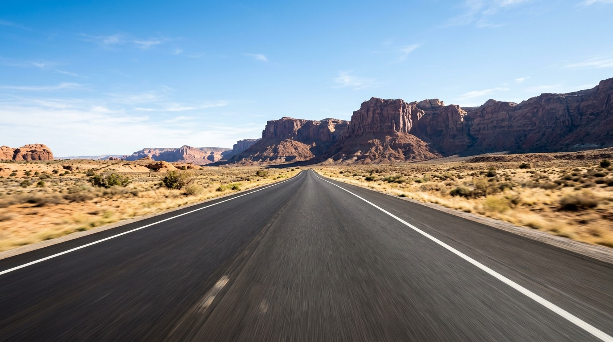
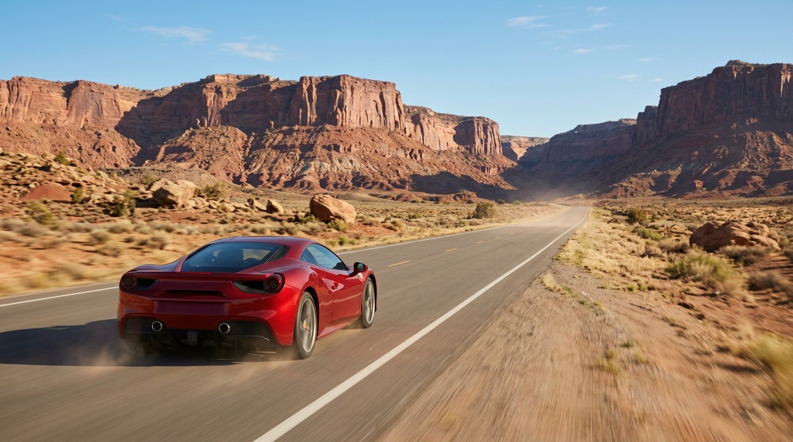
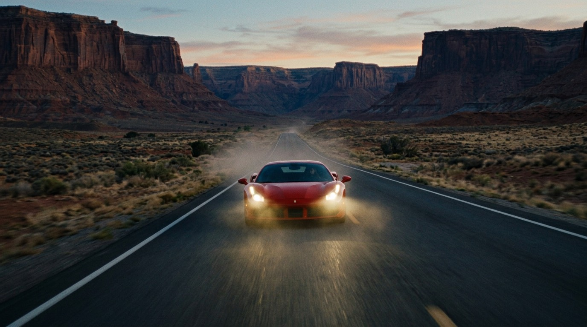
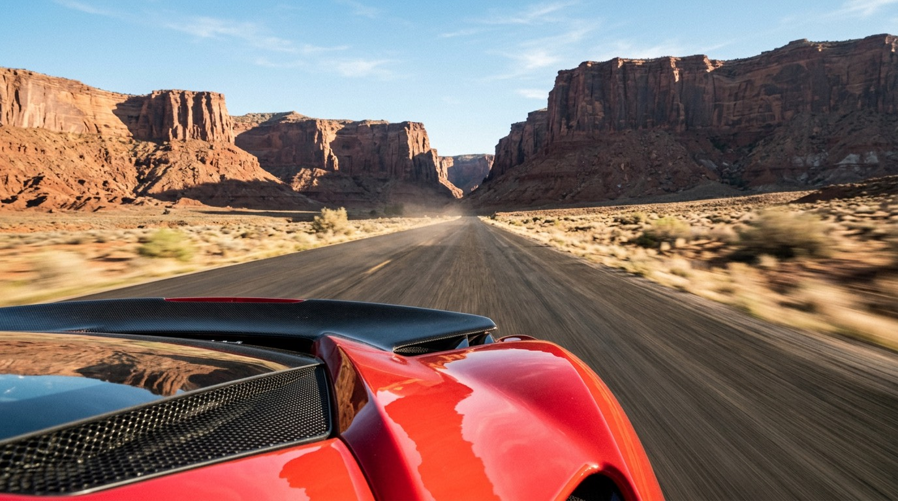

# Canyon grammar experiment — POV / FOLLOW / LEAD / MOUNTED

**Date:** 18 September 2026  
**Status:** Successful controlled comparison of the four whole-journey camera grammars. Same underlying story (red sports car, desert canyon route). Filmmaker recut with Kling 2.5 Turbo Pro after overnight Veo quality takes. Grammar held. Visual comparison is for a human; this page records what ran.

Archived stills and Kling cuts: [canyon-grammar/](canyon-grammar/).

Developer run log: [grammar_experiment_report.md](../grammar_experiment_report.md).

---

## What this session proved

TunnelVision can build **four complete journeys from one story** by changing only `cameraGrammar`. Director stills, CM pair reading, and the locomotion baseline all stayed on the selected grammar. The experimental variable was camera relationship, not four different movies.

Opening stills make the split obvious:

| Grammar | Opening A | What the still is doing |
| --- | --- | --- |
| **POV** | [pov-A-desert-highway.jpg](canyon-grammar/pov-A-desert-highway.jpg) | Camera **is** the traveler. Empty highway, unembodied, no car body. |
| **FOLLOW** | [follow-A-desert-highway.jpg](canyon-grammar/follow-A-desert-highway.jpg) | Invisible objective camera **behind** a persistent red car. |
| **LEAD** | [lead-A-desert-highway.jpg](canyon-grammar/lead-A-desert-highway.jpg) | Invisible objective camera **ahead**, facing the oncoming car. |
| **MOUNTED** | [mounted-A-desert-highway.jpg](canyon-grammar/mounted-A-desert-highway.jpg) | Camera **attached**; hood / decklid geometry stays in frame. |

Peak CM pairs (all shootable; no Agent END repair):

| Grammar | Peak pair | Set | Traversal | Pace | CM summary (inspector) |
| --- | --- | ---: | ---: | --- | --- |
| POV | B→C and C→D | 95 | 95 | fast / hyperspeed | Forward plunge into the tunnel; emerge onto the bridge. |
| FOLLOW | A→B | 92 | 95 | fast | High-speed pursuit into the canyon mouth. |
| LEAD | C→D | 95 | 95 | fast | Retreat through the tunnel ahead of the car. |
| MOUNTED | C→D | 95 | 95 | fast | Mount exits the visible tunnel onto the already-established bridge. |

Target test, same as the paper-airplane session: **same world, camera advanced (or retreated, for LEAD), subject still the continuity anchor where the grammar requires one.**

---

## Exact project setup

Four durable Projects in the configured Projects Folder. One grammar each. Collision handling named the POV run `GrammarTest-POVCanyonRun2`.

| Control | Value |
| --- | --- |
| Agency | **Agent** (`autonomous`) via headless `runJourneyAgent` |
| Destinations | **5** (A–E): highway → canyon road → rock tunnel → gorge bridge → mountain overlook |
| Camera grammar | POV / FOLLOW / LEAD / MOUNTED (one per project) |
| Duration | **Adaptive** |
| Overnight take intent | **Quality** → `google/veo-3.1-fast` |
| Morning recut | **Balanced** → `kwaivgi/kling-v2.5-turbo-pro` (Kling 2.5 Turbo Pro) |
| Image model | Nano Banana 2 |
| Generate audio | Off |
| Clip duration | CM `desiredDurationSeconds` mapped onto the selected model (Veo 4/6/8; Kling 2.5 5/10) |

Do not treat this as Screenwriter or LOOP. Headless CREATE JOURNEY already: generate A → Director B…E → sequential construct → CM + Camotion → NEW TAKE. Filmmaker later selected Kling Takes and exported.

---

## The journey prompt (shape)

Same route in all four. Grammar-specific camera language is in each Project story; the human still describes the movie, not Camotion.

Shared route:

```
desert highway
→ twisting canyon road
→ narrow rock tunnel
→ high bridge over a deep gorge
→ final open mountain road / overlook
```

FOLLOW story (the other three are in the experiment report):

```
Photorealistic cinematic FOLLOW journey tracking the same bright red sports car
at high speed through a dramatic desert canyon.

Follow the car along an open desert highway toward towering red-rock cliffs,
through a twisting canyon road, into a narrow rock tunnel, across a high bridge
above a deep gorge, and finally onto a spectacular open mountain road
overlooking the desert.

The red car remains the persistent subject and continuity anchor throughout.

The invisible objective camera stays in pursuit while allowing natural cinematic
variation in distance and framing as the car accelerates, pulls ahead, banks
through turns and moves through the changing landscape.

High-end live-action automotive cinematography, realistic terrain, natural light,
extreme speed and monumental scale.
```

### Why this prompt works (reuse the *shape*)

1. **One persistent subject** where the grammar needs one (FOLLOW / LEAD / MOUNTED). POV omits the car body on purpose.
2. **Named thresholds** the Director can route through: highway, canyon, tunnel, bridge, overlook.
3. **Grammar named once** at the Project setting. The story does not have to restate unembodied / no-hood / elastic follow / facing-the-subject / mount geometry.
4. **No explosions or a second movie.** The comparison is camera relationship.

---

## Beat geography

Director planned four subsequent destinations in every grammar. Intents from each Project’s canonical JSON.

### POV — `GrammarTest-POVCanyonRun2`

| Beat | Place | Still | Role |
| --- | --- | --- | --- |
| A | Open desert highway toward red-rock cliffs. Unembodied. | [pov-A-desert-highway.jpg](canyon-grammar/pov-A-desert-highway.jpg) | Opening. Camera is the traveler. |
| B | Canyon mouth, first tight curve. | [pov-B-canyon-mouth.jpg](canyon-grammar/pov-B-canyon-mouth.jpg) | Enter the canyon. |
| C | Tunnel blasted through the wall. | [pov-C-tunnel-entrance.jpg](canyon-grammar/pov-C-tunnel-entrance.jpg) | Threshold into the mountain. |
| D | High bridge over a chasm. | [pov-D-gorge-bridge.jpg](canyon-grammar/pov-D-gorge-bridge.jpg) | Exit the tunnel onto the span. |
| E | Sunlit mountain pass / horizon. | [pov-E-mountain-pass.jpg](canyon-grammar/pov-E-mountain-pass.jpg) | Clear the gorge. |

### FOLLOW — `GrammarTest-FOLLOWCanyonRun`

| Beat | Place | Still | Role |
| --- | --- | --- | --- |
| A | Red car ahead on the desert highway. | [follow-A-desert-highway.jpg](canyon-grammar/follow-A-desert-highway.jpg) | Opening pursuit. |
| B | Car carving canyon curves. | [follow-B-canyon-road.jpg](canyon-grammar/follow-B-canyon-road.jpg) | Stay in pursuit. |
| C | Car into the rock tunnel. | [follow-C-tunnel-entrance.jpg](canyon-grammar/follow-C-tunnel-entrance.jpg) | Threshold. |
| D | Car onto the gorge bridge. | [follow-D-gorge-bridge.jpg](canyon-grammar/follow-D-gorge-bridge.jpg) | Burst from the tunnel. |
| E | Car on the cliff road above the desert. Distance has opened. | [follow-E-mountain-pass.jpg](canyon-grammar/follow-E-mountain-pass.jpg) | Elastic FOLLOW, not a bolted-behind lock. |

### LEAD — `GrammarTest-LEADCanyonRun`

| Beat | Place | Still | Role |
| --- | --- | --- | --- |
| A | Car racing **toward** the camera at dusk. | [lead-A-desert-highway.jpg](canyon-grammar/lead-A-desert-highway.jpg) | Opening lead. |
| B | Retreat into the canyon road, car still approaching. | [lead-B-canyon-road.jpg](canyon-grammar/lead-B-canyon-road.jpg) | Facing the subject. |
| C | Inside the tunnel, looking back at the oncoming car; bridge visible beyond. | [lead-C-tunnel-entrance.jpg](canyon-grammar/lead-C-tunnel-entrance.jpg) | Lead through a threshold. |
| D | Car onto the bridge, camera still ahead. | [lead-D-gorge-bridge.jpg](canyon-grammar/lead-D-gorge-bridge.jpg) | Continue the retreat. |
| E | High pass, car still coming toward camera. | [lead-E-mountain-pass.jpg](canyon-grammar/lead-E-mountain-pass.jpg) | End on lead, not a forward POV fly-past. |

### MOUNTED — `GrammarTest-MOUNTEDCanyonRun`

| Beat | Place | Still | Role |
| --- | --- | --- | --- |
| A | Hood / decklid in the foreground, canyon ahead. | [mounted-A-desert-highway.jpg](canyon-grammar/mounted-A-desert-highway.jpg) | Opening mount. |
| B | Canyon curves from the mount. | [mounted-B-canyon-road.jpg](canyon-grammar/mounted-B-canyon-road.jpg) | Inherit the car’s travel. |
| C | Tunnel mouth from the mount. | [mounted-C-tunnel-entrance.jpg](canyon-grammar/mounted-C-tunnel-entrance.jpg) | Threshold. |
| D | Bridge from the mount. | [mounted-D-gorge-bridge.jpg](canyon-grammar/mounted-D-gorge-bridge.jpg) | Exit the tunnel. |
| E | Mountain road from the mount. | [mounted-E-mountain-pass.jpg](canyon-grammar/mounted-E-mountain-pass.jpg) | Final overlook. |









---

## Scores and Agent repair

No canonical repair. Every pair was `shootable`. Traversal stayed well above the < 30 END-reshoot gate.

| Grammar | A→B set/trav | B→C | C→D | D→E |
| --- | --- | --- | --- | --- |
| POV | 92 / 95 | 95 / 95 | 95 / 95 | 95 / 85 |
| FOLLOW | 92 / 95 | 85 / 80 | 90 / 90 | 85 / 90 |
| LEAD | 80 / 65 | 70 / 85 | 95 / 95 | 95 / 90 |
| MOUNTED | 95 / 90 | 95 / 92 | 95 / 95 | 92 / 85 |

LEAD A→B is the weakest pair (set 80 / traversal 65) and still shootable. CM summaries stay in lead language (“continuous backward travel ahead of the advancing car”) instead of rewriting the pair into forward POV.

---

## Pipeline (what actually ran)

1. **Headless overnight** (`web/journey-cli.ts --experiment-canyon`): same JourneyAgent as Agent CREATE JOURNEY. Quality → Veo 3.1 Fast. Adaptive duration.
2. **Veo caps / provider errors** (not grammar failures):
   - FOLLOW: empty `Prediction failed:` while B→C / C→D were in flight (Veo request cap).
   - MOUNTED D→E: Veo third-party content-provider refusal (`code: 3`).
   - POV / LEAD: all four Veo takes landed; first headless concat hit a stills-registry size bug, later recovered.
3. **Filmmaker morning recut:** Balanced Kling 2.5 Turbo Pro NEW TAKEs on every traversal. Those first selected assemblies (`*_v2.mp4` / MOUNTED `*_v3.mp4`) were **not unique grammar cuts** — persisted take video ids collided across projects (`video-a-b-take-2`, …), so opening another project could copy the wrong clip into FOLLOW / LEAD / POV. Those files are not archived.
4. **Filmmaker afternoon unique retakes:** new Kling 2.5 Turbo Pro takes with unique files, then export. Selected Takes:
   - POV (`GrammarTest-POVCanyonRun2`): take 3 on every pair.
   - FOLLOW: take 3 on every pair (D→E take 3 is the morning unique 10s clip).
   - LEAD: take 3 on A→B, B→C, D→E; take 4 on C→D.
   - MOUNTED: take 2 on A→B, B→C, C→D (original unique Kling); take 3 on D→E.
5. **Export** from the product (Downloads filenames below). Kling 2.5 mapped CM desired 4–8s onto **5s or 10s**.

Kling selected-take durations:

| Grammar | A→B | B→C | C→D | D→E | Cut length |
| --- | ---: | ---: | ---: | ---: | ---: |
| POV | 10 | 5 | 5 | 10 | ~30.3s |
| FOLLOW | 10 | 5 | 5 | 10 | ~30.3s |
| LEAD | 10 | 5 | 10 | 10 | ~35.3s |
| MOUNTED | 10 | 5 | 5 | 10 | ~30.3s |

---

## Kling outputs (filmmaker-selected cuts)

Copied from `~/Downloads/` on 18 September 2026 afternoon. These are the unique recuts after the morning assemblies proved to share clips. Genesis Slice 13 movies are 1280-wide web encodes of the same four files.

| Grammar | Downloads original | Archived here |
| --- | --- | --- |
| POV | `GrammarTestPOVCanyonRun_v3.mp4` | [kling-pov-canyon-run.mp4](canyon-grammar/kling-pov-canyon-run.mp4) |
| FOLLOW | `GrammarTestFOLLOWCanyonRun_v3.mp4` | [kling-follow-canyon-run.mp4](canyon-grammar/kling-follow-canyon-run.mp4) |
| LEAD | `GrammarTestLEADCanyonRun_v3.mp4` | [kling-lead-canyon-run.mp4](canyon-grammar/kling-lead-canyon-run.mp4) |
| MOUNTED | `GrammarTestMOUNTEDCanyonRun_v4.mp4` | [kling-mounted-canyon-run.mp4](canyon-grammar/kling-mounted-canyon-run.mp4) |

LEAD’s GitHub copy is an H.264 transcode of the Downloads original (105 795 547 bytes, over GitHub’s 100 MiB file limit). Picture and duration match; bitrate is lower. POV / FOLLOW / MOUNTED archives are byte copies of Downloads.

Live Projects (gitignored `projects/`):

- `/Users/ddegeest/Source/tunnelvision/projects/GrammarTest-POVCanyonRun2`
- `/Users/ddegeest/Source/tunnelvision/projects/GrammarTest-FOLLOWCanyonRun`
- `/Users/ddegeest/Source/tunnelvision/projects/GrammarTest-LEADCanyonRun`
- `/Users/ddegeest/Source/tunnelvision/projects/GrammarTest-MOUNTEDCanyonRun`

---

## Recipe: any subject, same four-grammar test

Keep the **route**. Change only the subject and the Project grammar.

```
Photorealistic cinematic <GRAMMAR> journey <through ONE WORLD>.
Travel <ROUTE WITH NAMED THRESHOLDS>.
<GRAMMAR RELATIONSHIP SENTENCE>
High-end live-action cinematography, realistic terrain, natural light.
```

Project checklist:

- Set **Camera grammar** once (POV / FOLLOW / LEAD / MOUNTED).
- Adaptive duration unless you are locking a model’s discrete lengths.
- Fast/Balanced/Quality is a take intent, not a grammar. This session’s watchable cuts are **Balanced / Kling 2.5 Turbo Pro**.
- One grammar for the whole journey. Do not mix POV on A→B with FOLLOW on B→C.

How to judge pairs:

- POV: unembodied, path-relative forward travel, no persistent rig.
- FOLLOW: same car (or skier, koi, …) still the anchor; distance may breathe; do not overtake.
- LEAD: still facing the subject while retreating; not a forward fly-past.
- MOUNTED: mount geometry may stay; motion inherits the vehicle.

---

## Anti-patterns (from this run)

- **Do not use overnight Veo Quality as the only proof.** Veo’s request cap aborted FOLLOW mid-flight and refused MOUNTED D→E. Grammar stills and CM were already done.
- **Do not treat elastic FOLLOW distance as a miss.** FOLLOW E is a wider, higher view with the car farther ahead. That is the FOLLOW principle, not MOUNTED.
- **Do not “fix” LEAD by restoring a universal forward baseline.** LEAD A→B scored lower than the other grammars and still stayed in lead language.
- **Do not register concatenated MP4s in the stills runtime registry.** That 12 MB image path failed headless export overnight; local-file copy is the fix.
- **Do not reuse a take video media id across projects.** Morning FOLLOW / LEAD / POV selected takes collided on `video-a-b-take-2` and exported as the same clip. Unique retakes (and unique persisted media ids) are required before a four-grammar comparison is real.

---

## Reproduction checklist

1. Four new Projects, one grammar each, same story family, Adaptive duration.
2. Headless or Agent CREATE JOURNEY until five canonicals and four CM pairs exist.
3. Recut traversals with Kling 2.5 Turbo Pro (Balanced) if Veo is capped.
4. Export the selected Takes. Compare openings A and the four MP4s side by side.

## Source notes

- Overnight runner: `web/journey-cli.ts --experiment-canyon`, logs under `docs/grammar_experiment/logs/`.
- Headless execution of the **Veo** pass: PARTIAL (provider caps + export-registry bug). Headless execution of **Director / stills / CM**: SUCCESS.
- Filmmaker Kling recuts: product UI, 18 September 2026. Morning first pass (~10:52–11:06, `*_v2` / MOUNTED `*_v3`) was not unique. Afternoon unique retakes (~12:21–12:46) are the archived cuts (`*_v3` / MOUNTED `*_v4`).
- Canonical JPEGs here are 70-quality conversions of each Project’s `canonicals/<letter>/take-01.png`.
- No scores were guessed. CM numbers are from each Project’s `traversals/*/traversal.json`.
