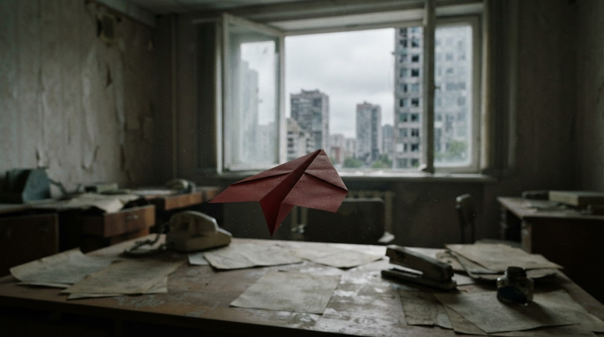
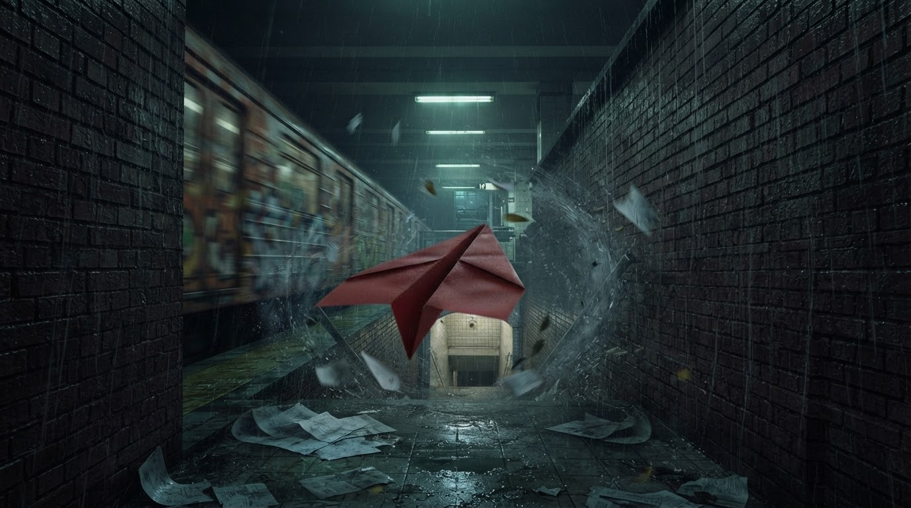

# Red paper airplane — reference journey

**Date:** 16 September 2026  
**Status:** Best live Agent output to date. Use this session as the pattern for any new subject, not as a one-off prompt to copy verbatim.

This document records what was actually run in the untitled product project on `localhost:5173`, why the footage worked, and how to aim for the same kind of result with a different world.

Session stills (ephemeral runtime media, archived here):
[red-paper-airplane/](red-paper-airplane/).

---

## What this session proved

A small, high-contrast **followable subject** (one red paper airplane) in **every** canonical, always ahead of the camera, through **named physical thresholds**, produced the strongest adjacent-pair shoot of the day.

The peak pair was **C→D** in the subway corridor:

- Set consistency **100**
- Traversal confidence **95**
- Pace **FAST**
- CM summary (inspector): the start and end stills are nearly identical framings of a highly dynamic scene; the video model must animate frozen water splashes, flying debris, and rain while driving the camera forward. A direct forward tracking shot following the red paper airplane toward the illuminated subway stairs.

That is the target: **same world, camera advanced, subject still in frame, weather already moving.**

---

## Exact project setup

These are the product settings that produced the session. Defaults are noted where the UI did not show a non-default.

| Control | Value |
| --- | --- |
| Project | `UNTITLED` (in-memory; not a durable save) |
| Agency | **Agent** (`CREATE JOURNEY` runs JourneyAgent, including canonical repair) |
| Journey destinations | **6** (A–F), not AUTO |
| Generate all destinations | **On** |
| Shoot | **On** (Agent NEW TAKE as each inbound pair is established) |
| Default take intent | **Fast** (⚡ on Takes) |
| Image model | **Nano Banana 2 Lite** (canonicals are 1376×768, ~16:9, 1K) |
| Video model for Fast | Product default mapping (**Pruna P-Video**) unless Project settings were changed |
| Clip duration | Product default **6s** per take (timeline 0:18 = three completed Fast takes) |

Do not turn this into a Screenwriter or LOOP workflow. Agent CREATE JOURNEY already: generate A from the story → Director plan B…N → construct each destination from the previous accepted still → Cinematographer + Camotion on each actual pair → NEW TAKE → if Traversal Confidence **< 30**, reshoot the new **END** only.

---

## The journey prompt

Captured from the Project rail / destination A Story field. The last clause was clipped in screenshots; generated geography after the subway matches a continuation onto a roof and out over the city (see [Beat geography](#beat-geography)).

```
Follow a single red paper airplane on a continuous journey through an enormous
storm-damaged city. Begin inside a quiet abandoned office as the airplane lifts
from a desk and drifts slowly toward an open window. Follow it outside as wind
suddenly catches it, carrying it rapidly between skyscrapers, around corners,
through rain and swirling debris. Descend with it into a narrow alley, then
follow it through an open subway entrance and down into the
```

### Why this prompt works (reuse the *shape*, not the city)

1. **One persistent subject.** “A single red paper airplane” — not a crowd, not a new hero per beat. The subject is small, saturated, and readable against gray weather.
2. **Opening is a still, not a montage.** Desk → open window. The product opening prompt already forbids anticipating later destinations.
3. **Pace is written into the world**, not as camera jargon. Slow lift indoors, then wind catches it. CM independently chose FAST on the subway pair; the story had already earned speed.
4. **Thresholds are physical:** window, between buildings, alley, subway entrance, stairs, (later) roof hatch. Director/CM can route through those. “Become more dramatic” is not a route.
5. **No POV / camera-body language.** The product injects unembodied first-person POV on stills and video. Story text should not say FPOV, hands, or held camera.
6. **Weather that video can animate.** Rain, debris, papers, splashes already exist in the stills. C→D’s CM note is exactly that.

---

## Beat geography

Observed from the Shoot timeline, inspector, Agent conversation, and archived stills. Letter assignment for mid-journey stills is from the 11:20 Shoot view (A–E on the rail; F still in flight).

| Beat | Place | Still | Role |
| --- | --- | --- | --- |
| A | Abandoned office. Plane leaving a desk toward an open window; damaged towers outside. | [A-abandoned-office.jpg](red-paper-airplane/A-abandoned-office.jpg) | Opening. Generated from the journey story only. |
| B | Next interior / corridor toward the exit (timeline thumb). | (not separately archived) | Leave the office along the travel vector. |
| — | Rain alley between apartment blocks; plane heading into a lit subway mouth. | [subway-entrance-alley.jpg](red-paper-airplane/subway-entrance-alley.jpg) | Classic threshold still. |
| C | Brick subway corridor, green overhead light, train, flying paper, plane ahead. | [subway-corridor.jpg](red-paper-airplane/subway-corridor.jpg) | C→D start. |
| D | Same corridor, closer to the illuminated stairs down. | [subway-corridor-toward-stairs.jpg](red-paper-airplane/subway-corridor-toward-stairs.jpg) | C→D end. Nearly the same framing — this is why 100 / 95. |
| E | Emerge onto the roof, looking **forward** over the city, plane flying away. | [E-rooftop-forward.jpg](red-paper-airplane/E-rooftop-forward.jpg) | Repair target for D→E. |
| E rejected | Same hatch, camera **outside looking back** at the opening. | [E-hatch-lookback-rejected.jpg](red-paper-airplane/E-hatch-lookback-rejected.jpg) | Failure mode. Agent asked to reshoot END. |
| F / later | Plane over storm-and-sunset city. | [city-aerial.jpg](red-paper-airplane/city-aerial.jpg), [rooftop-over-city.jpg](red-paper-airplane/rooftop-over-city.jpg) | Far destination; keep the plane as the tracking object. |





---

## Scores and Agent repair (what actually happened)

Approximate Shoot-rail scores at 11:20:

| Pair | Set consistency | Traversal confidence | Footage |
| --- | ---: | ---: | --- |
| A→B | 90 | 95 | Fast take 1 |
| B→C | 85 | 85 | Fast take 1 |
| C→D | **100** | **95** | Fast take 1 — the reference take |
| D→E | **15** | **15** | Still blocking / repairing at capture time |

Agent conversation (same timestamp):

- D→E needs a stronger spatial connection.
- Repair recommendation: **RESHOOT END** (product rule: only the new generated END; START is not rewritten; Traversal Confidence **< 30** is the gate; Set Consistency does not trigger repair).
- Instruction, quoted from the rail:

  > Generate the END image from the perspective of emerging onto the roof — position the camera looking forward out over the cityscape, rather than looking backward at the hatch from the outside. The red paper airplane should be flying forward away from the camera, consistent with a continuous following shot.

That sentence is the whole spatial lesson of the session.

Two reshoot-complete events still showed traversal **15** before the forward roof still landed. Underground stairs → open roof is a hard joint. The subway pair succeeded because C and D were the **same volume, camera advanced**. D→E asked the camera to change worlds in one beat.

---

## Pipeline (do not skip steps)

What Agent CREATE JOURNEY ran, in product order:

1. **Opening A** from `openingFrameGenerationPrompt(story)` — only the first instant; unembodied POV; world subjects may appear; do not show text.
2. **Director plan** for B…F from the story + A. Beats are places the camera can travel, not a mood board.
3. **Sequential construct** of each destination from the previous **accepted** still (`destinationConstructionPrompt`): spatial progression is primary; same world; camera must advance; look-ahead is far-field only.
4. **Cinematographer** on each actual adjacent pair: set consistency, traversal confidence, pace, route, `segmentPromptAddition`.
5. **Camotion** shooting frames A′/B′ from the bridged CameraMotionPlan (this session: exposure **0.06 / Fast** on at least one recorded plan; VP on the travel target, protect on).
6. **NEW TAKE** (Fast) as soon as the inbound pair exists; later canonical work may overlap.
7. **Repair** if traversal < 30: reshoot END with CM `repairInstruction`, then re-evaluate. Max two attempts per segment.

Video prompt composition is not an LLM merge: optional extreme-pace lead-in + CM `segmentPromptAddition` + frozen locomotion baseline (`composeShootingPrompt`). C→D’s addition was the tracking-shot language above; pace FAST fills “at a constant, fast speed.”

---

## Recipe: any subject, same results

Replace the airplane. Keep the **mechanics**.

### 1. Write the story in this template

```
Follow a single <SUBJECT> on a continuous journey through <ONE WORLD>.
Begin inside <SPECIFIC ROOM> as <SUBJECT> <SLOW START ACTION> toward <VISIBLE EXIT>.
Follow it outside as <FORCE> catches it, carrying it <FASTER> between / through
<VOLUME A>, around <CORNER OR THRESHOLD>, through <WEATHER THAT MOVES>.
Descend / climb / pass with it into <NARROW CONNECTOR>, then follow it through
<NAMED ENTRANCE> and into <NEXT DISTINCT VOLUME>.
```

Subject rules:

- One object or creature, readable in a wide shot (color or silhouette).
- It stays the **same instance** in every beat.
- It flies / walks / drifts **away from the camera**, never toward a look-back portrait.
- It is in the travel corridor (near the vanishing point), not a side decoration.

World rules:

- One continuous environment family (one city, one forest, one station). New rooms, not new planets, except at a **named threshold**.
- Every sentence should imply a door, window, stair, alley, hatch, arch, or path.
- Put motion in the still: rain, dust, papers, crowds, water, cloth. Frozen activity is what Fast video interpolates.
- Do not write “cinematic first-person,” “the camera,” “we see,” or “do not show people.” The product already handles unembodied POV; subjects may appear.

Length: one short paragraph. Six destinations is enough for office → street → threshold → inner volume → emerge → far vista. AUTO is fine if the story only needs 3–4 later beats. Do not add a beat for “approach the door” and another for “go through the door” when one shot can do both.

### 2. Set the project

1. New untitled project.
2. Paste the story.
3. Destinations **6** (or AUTO for a shorter story).
4. **Generate all destinations** on, **Shoot** on.
5. Agency **Agent**.
6. Leave image model on Nano Banana 2 Lite / 1K unless you are deliberately paying for Nano Banana 2.
7. Leave default take **Fast** for this recipe. Quality (Seedance) is a later recut on the same canonicals, not the discovery pass.
8. Create journey. Do not interrupt sequential construct. Watch D→E-class joints for repair.

### 3. Judge pairs like C→D, not like posters

A good adjacent pair:

- Same materials and lighting character.
- Camera has **moved forward**; foreground from the start still is gone or beside the lens.
- Subject still in frame, smaller or further along the same path.
- Threshold visible ahead (stairs, door, light).
- Set consistency high; traversal high.

A bad END (this session’s hatch):

- Camera has turned around to admire the hole it came out of.
- Subject is in the opening instead of ahead over the next volume.
- The still is a postcard of the threshold, not a continuation of travel.

If Agent repair fires, read the instruction. If it says look forward and the new still still looks back, reshoot END yourself with that sentence in the beat, or replace the still. Do not “fix” it by restyling the same composition.

### 4. Optional Directed recut

Once Agent has a C→D-quality pair you love:

- Keep those canonicals.
- **+ NEW TAKE** at Balanced or Quality on that leg only.
- Do not regenerate A–F unless a still is actually wrong.

---

## Anti-patterns (seen around this session)

- **Look-back hatch / doorway.** Travel must exit looking **out**, not at the door you used.
- **Subject inventory.** Extra people, vehicles, or a second airplane that is not the follow target.
- **World hop without a connector.** Subway stairs straight to a rooftop vista is the D→E failure. Put a hatch, stairwell, or corridor beat if you need that change.
- **Prompting the camera.** Story should never mention POV, FPV, or “cinematic tracking shot.” That belongs in CM `segmentPromptAddition` after the stills exist.
- **Same composition, new weather.** Construction prompt treats that as failure. The camera must advance.
- **Fast take as the only quality bar.** Fast is how this session *found* the route. Recut the winning pair hotter if needed.

---

## Reproduction checklist

- [ ] One followable subject named in sentence one
- [ ] Opening is a single room + visible exit
- [ ] At least three named thresholds
- [ ] Weather or debris that can move in video
- [ ] No camera/POV words in the story
- [ ] Agent + generate all destinations + Shoot
- [ ] Six or fewer destinations unless the story truly needs more
- [ ] After the run: confirm each pair is same-world + camera-forward + subject-ahead
- [ ] If traversal < 30: END looks along travel, not back at the threshold

---

## Source notes

- Live UI: untitled Agent project, Shoot view, 16 Sep 2026 ~11:20.
- Runtime store (dev): `tunnelvision-runtime-media-*` under the macOS temp dir; **not durable**. Canonicals worth keeping were copied into [red-paper-airplane/](red-paper-airplane/).
- Product rules cited: [AGENTS.md](../AGENTS.md) (Agent CREATE JOURNEY, repair gate), [destination.ts](../../web/src/project/destination.ts) (opening and construct prompts), [shooting-prompt.ts](../../media/src/cinematographer/shooting-prompt.ts) (baseline + pace), [journey-agent-repair.ts](../../web/src/project/journey-agent-repair.ts) (traversal < 30, END only).
- This is a filmmaking reference, not a Camotion retune and not a new Agent loop.
- Prompting lessons extracted from this run (do not copy the literal prompt): [PROMPT_COACH.md](../PROMPT_COACH.md).
